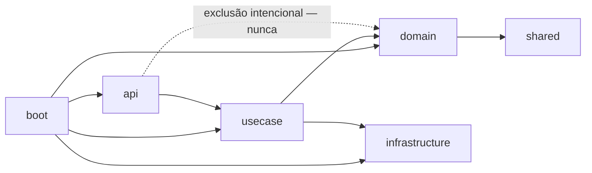

# SCOS Flow


## 📋 Índice

- [Visão Geral](#-visão-geral)
- [Estado Atual do Projeto](#-estado-atual-do-projeto)
- [Arquitetura](#-arquitetura)
- [Estrutura de Módulos](#-estrutura-de-módulos)
- [Convenções do Projeto](#-convenções-do-projeto)
- [Stack Tecnológica](#-stack-tecnológica)
- [Como Rodar](#-como-rodar)
- [Testes](#-testes)
- [Roadmap](#-roadmap)
- [Licença](#-licença)

---

## 🎯 Visão Geral

**Flow** (`br.com.sawcunhaos:flow`) é o monorepo Maven multi-módulo do SawCunhaOS. Todo o trabalho de produto até agora está concentrado no módulo **`organization`** — o motor fundacional de **identidade, organização e governança de acesso** de um ISP (Internet Service Provider) brasileiro, Fase 1 (P0) do produto: back-end puro de API/gRPC, sem front-end no escopo desta etapa. Os demais módulos do monorepo (`notification`, `geotemporal`) são reservas vazias para fases futuras — ver [Estrutura de Módulos](#-estrutura-de-módulos).

O módulo `organization` resolve três passivos concretos de um ISP:

- **Estrutura organizacional íntegra** — empresas/filiais em hierarquia sem ciclos e sem filial órfã ativa, departamentos, cargos e jornada de trabalho padrão por cargo.
- **Governança de acesso Zero Trust** — toda requisição autenticada de um Perfil sujeito a bloqueio de turno é avaliada contra a jornada de trabalho vigente da filial, no back-end, antes de qualquer lógica de negócio — nunca confiando em validação de cliente.
- **Kill Switch** — desligar ou bloquear um colaborador invalida as sessões dele em menos de 1 segundo via denylist Redis síncrono, com defesa em profundidade via Keycloak Admin API em paralelo.

Login e aprovação de acesso seguem uma cadeia de 3 níveis (Supervisor → Gerente → grupo de acesso de sistema), nunca autoaprovada pelo próprio solicitante, com escalonamento automático por SLA.

---

## 📊 Estado Atual do Projeto

O projeto é conduzido pelo método **BMAD** (épicos/stories em `_bmad-output/`). Estado do sprint em `_bmad-output/implementation-artifacts/sprint-status.yaml`.

### Baseline pré-existente (antes da quebra em épicos atual)

Já implementado e em produção antes desta rodada de planejamento, confirmado por auditoria de código:

- CRUD completo de **Company** (matriz/filial), **Department**, **Position**, **Employee**, com ciclo `enable`/`disable` e catálogo de motivos obrigatório (`SCOS_REASON_*`) para transições de status sensíveis.
- **Login** vinculado a Funcionário, **Profile** (Perfil) e **Resource** (permissão), com sincronização parcial ao Keycloak.
- Autenticação sistema-a-sistema via interceptor gRPC + segredo cifrado em repouso.
- Auditoria (`@Auditable`), idempotência de requisição (jDempotent/Redis), mascaramento de PII em log, tratamento central de erro (`ScosException`/RFC 9457).
- Schema de banco da Etapa 1 (Liquibase) já criado, incluindo tabelas novas (`SCOS_LOGIN_APPROVAL_REQUEST`, `SCOS_SHIFT_ENFORCEMENT_LOG`) e triggers de bloqueio de `DELETE` físico em tabela de histórico/decisão.

### Epic 0 — Fundação Técnica: Tipos Temporais e Relógio Injetável — ✅ **done**

Débito técnico transversal, pré-requisito de confiabilidade para Epic 5 (Governança de Turno) e Epic 6 (Kill Switch):

| Story | Status | Entrega |
|---|---|---|
| 0.1 — Cobertura de Testes do Caminho Crítico de Autenticação de Sistema | ✅ done | Testes determinísticos de `TokenAuthorizationInterceptor`, `SystemSecretCryptoService`, `ScosSystemServiceBean.validateSecretKey`; correção de 3 bugs de configuração/typo; 4º bug de tratamento de exceção corrigido |
| 0.2 — Padronizar Tipos Temporais e Introduzir Clock Injetável | ✅ done | 14 campos `LocalDateTime` migrados para `Instant` contra coluna `TIMESTAMPTZ`; `Clock` injetável no lugar de `.now()` estático no domínio; correção de bug de semântica do grace period de rotação de segredo |
| 0.3 — Modelar Fuso Horário por Filial e Avaliar Janela de Turno | ✅ done | `SCOS_COMPANY.TIME_ZONE` (IANA) + `Company.timeZone`; `ShiftWindowEvaluator`, avaliador único de janela de turno (`Instant` → hora local, trata turno cruzando meia-noite) |

### Epic 1 — Estrutura Organizacional — 🔄 **em andamento** (stories criadas, implementação pendente)

RH consegue montar e manter toda a estrutura organizacional do ISP. Cobre FR-1 a FR-4 do PRD.

| Story | Status | Escopo |
|---|---|---|
| 1.1 — Bloquear Ciclo na Hierarquia de Empresa | 📝 ready-for-dev | Guarda de ciclo indireto na hierarquia de Empresa via CTE recursiva (`WITH RECURSIVE`) |
| 1.2 — Ciclo de Vida Completo de Empresa | 📝 ready-for-dev | Use Cases `activate`/`inactivate`/`disable`/`enable` para Company, com motivo obrigatório e histórico |
| 1.3 — Guardas de Integridade ao Desativar Empresa | 📝 ready-for-dev | Impede inativar a última matriz ativa, bloquear a única empresa ativa, ou desativar/bloquear empresa com filial ativa em qualquer nível da subárvore |
| 1.4 — Departamento e Cargo (Verificação) | 📝 ready-for-dev | Story de regressão — as guardas de Department/Position já existem e funcionam; fecha gap de cobertura de teste de integração |
| 1.5 — Template de Jornada de Trabalho por Cargo | 📝 ready-for-dev | CRUD de `PositionWorkSchedule` (horário por dia da semana), contrato OpenAPI já publicado, camada de aplicação a criar |

### Epic 2 a Epic 6 — 📋 **backlog** (ainda não quebrados em implementação)

| Épico | Objetivo |
|---|---|
| Epic 2 — Ciclo de Vida do Funcionário | Admissão com cópia de jornada, ativar/inativar/bloquear/recontratar, licença/férias com retorno assistido |
| Epic 3 — Login do Funcionário com Aprovação | Criação/reativação de Login com cadeia de aprovação de 3 níveis, escalonamento automático |
| Epic 4 — Acesso de Sistema e Governança de Perfil | Login de sistema/serviço (sem Funcionário) e CRUD de Perfil, ambos com aprovação de grupo de TI |
| Epic 5 — Governança de Turno (Zero Trust) | Bloqueio de requisição fora da jornada de trabalho, plantão pré-aprovado, auditoria imutável de decisão |
| Epic 6 — Kill Switch | Invalidação síncrona de sessão via denylist Redis; reativação nunca restaura sessão antiga |

> Detalhe completo de cada épico/story (contexto, acceptance criteria, dev notes): `_bmad-output/planning-artifacts/epics.md` e `_bmad-output/implementation-artifacts/*.md`.

---

## 🏛️ Arquitetura

**DDD tático em camadas** (hexagonal-adjacente), já ratificado no código — não um template genérico:

```
domain    → entidades JPA, domain services (specification + ServiceBean), repositórios
usecase   → orquestração: interface pública XxxUseCase + XxxUseCaseBean (@Service, package-private)
api       → XxxDelegate implements XxxApiDelegate — fino, sem regra de negócio
infrastructure → cross-cutting (permissões, filtros, enums transversais)
boot / grpc-boot → composition roots (REST e gRPC)
```

### Regra de dependência



`api` **nunca** enxerga `domain` diretamente — só via `usecase`. Regra que cruza entidades ou pertence ao estado do próprio agregado vive em `domain`; orquestração de fluxo (sem decidir regra) vive em `usecase`.

### Padrão real: specification + Bean (domain)

```java
public interface CompanyService {
    CompanyOutput create(@NonNull CompanyInput companyInput);
    void update(@NonNull CompanyInput companyInput);
    CompanyOutput findById(@NonNull Long companyId);
    // ...
}

@Service
@RequiredArgsConstructor
class CompanyServiceBean implements CompanyService {
    // implementação package-private — só a interface é pública
}
```

### Padrão real: Use Case (usecase)

```java
public interface ActivateCompanyUseCase {
    void execute(@NonNull Long id, @NonNull CompanyStatusTransitionRequest request);
}

@Service @RequiredArgsConstructor @Transactional(rollbackFor = ScosException.class)
class ActivateCompanyUseCaseBean implements ActivateCompanyUseCase {
    private final CompanyService companyService;
    @Override
    public void execute(@NonNull Long id, @NonNull CompanyStatusTransitionRequest request) {
        companyService.activate(id, request.reasonId(), request.observation());
    }
}
```

### Padrão real: Delegate (api) — contrato OpenAPI-first

O contrato REST é escrito **primeiro** em `etc/api/organization/*.yml`; `openapi-generator-maven-plugin` gera `XxxApiDelegate` (interface); a classe concreta só implementa e delega:

```java
@Component
@RequiredArgsConstructor
public class CompanyDelegate implements CompanyApiDelegate {
    private final ActivateCompanyUseCase activateCompanyUseCase;
    // ...
    @Override
    public Void activateCompany(Long id, CompanyStatusTransitionRequest request, ...) {
        activateCompanyUseCase.execute(id, request);
        return null; // 204
    }
}
```

Endpoint sem `@Override` cai no `default` gerado, que lança `MethodNotImplementedException` — sinal claro de rota ainda não implementada.

---

## 📁 Estrutura de Módulos

Monorepo Maven multi-módulo (raiz `flow`, `scos-bom` como parent):

```
flow/                                       (artifactId: flow, packaging: pom)
├── organization/                           (o produto desta fase)
│   ├── flow-organization-domain/           regras de negócio, entidades JPA, repositórios
│   ├── flow-organization-usecase/          orquestração de casos de uso
│   ├── flow-organization-api/              delegates REST, DTOs gerados do OpenAPI
│   ├── flow-organization-infrastructure/   filtros, enums de permissão, cross-cutting
│   ├── flow-organization-boot/             composition root REST (ScosOrganizationApplication)
│   ├── flow-organization-grpc-boot/        composition root gRPC (autenticação sistema-a-sistema)
│   ├── flow-organization-grpc-proto/       contratos protobuf
│   ├── flow-organization-resources/        changelogs Liquibase, seed de dados
│   ├── flow-organization-shared/           ExceptionCodeError, mensagens PT/EN, value objects
│   └── flow-security-starter/              lib de segurança reusável entre projetos SCOS
│
├── server-fat/                             composition root alternativo (fat-jar agregando organization via BOM)
├── notification/                           módulo-esqueleto (0 classes) — reserva para Etapa 3 (Notificação Híbrida)
├── geotemporal/                            módulo-esqueleto (0 classes) — reserva para Etapa 2 (Motor Geotemporal)
└── infrastructure/                         módulo raiz de infraestrutura técnica compartilhada
```

> ⚠️ Questão em aberto registrada no planejamento: qual módulo é o deployável real de produção (`server-fat` vs `flow-organization-boot` standalone) ainda não foi decidido — os dois coexistem hoje, nenhum foi removido.

---

## 📖 Convenções do Projeto

Convenções já em vigor no código, não reinventadas a cada story:

| Concern | Convenção |
|---|---|
| Nomenclatura de banco | `SCOS_<ENTIDADE>` / `PK_SCOS_<T>` / `FK_<COL>_SCOS_<T>` |
| Permissão | `ACTION_RESOURCE` (ex.: `ENABLE_COMPANY`), 1:1 com `x-authorize` do OpenAPI |
| Erro de domínio | `ScosException` + `ExceptionCodeError` (`SCOS_<MÓDULO>_<NNN>`) — **nunca** `RuntimeException` cru |
| Resposta HTTP | RFC 9457 `ProblemDetail`, tratamento central via `ExceptionsHandler` |
| Transação | `@Transactional(rollbackFor = ScosException.class)` em todo Use Case de escrita |
| Auditoria | `@Auditable` na entidade + listener Hibernate; tabela de histórico com trigger de bloqueio físico de `DELETE` |
| Idempotência | `@JdempotentResource`/`@JdempotentRequestPayload` via Redis, já gerado a partir de `x-jdempotentrequestpayload`/`x-jdempotentresource` no YAML |
| Tipos temporais | `Instant` ↔ `TIMESTAMPTZ` (instante), `LocalDate` ↔ `DATE` (calendário), `LocalTime` ↔ `TIME` (hora de parede) — `LocalDateTime` e `.now()` estático proibidos no domínio (Epic 0) |
| Consulta hierárquica/recursiva | CTE `WITH RECURSIVE` no banco — nunca caminhada em memória Java nem estrutura denormalizada nova |
| Vocabulário de enum | Sempre em inglês no código/schema; rótulo PT-BR só em mensagem ao usuário |

---

## 🛠️ Stack Tecnológica

| Tecnologia | Versão / Uso |
|---|---|
| Java | 25 |
| Spring Boot / Spring Framework | 4.x / 7 |
| PostgreSQL | 18+ |
| Redis | Cache, idempotência (jDempotent), denylist do Kill Switch |
| Keycloak | Identity Provider — OAuth2/JWT resource server |
| Liquibase | Migrations e controle de schema |
| MapStruct | Mapeamento entidade ↔ DTO |
| QueryDSL | Consultas dinâmicas type-safe |
| gRPC / Protobuf | Autenticação e registro sistema-a-sistema |
| JUnit 5 + Mockito + AssertJ | Testes unitários |
| Testcontainers | Testes de integração com Postgres/Redis reais |
| OpenAPI Generator | Geração de controllers/DTOs a partir do contrato (`etc/api/organization/*.yml`) |
| Micrometer / OpenTelemetry | Observabilidade (Prometheus/Grafana provisionados em `etc/infra/`) |

---

## ⚙️ Como Rodar

### Pré-requisitos

- Java 25, Maven 3.9+, Docker (para os serviços de apoio)

### Subir dependências de infraestrutura

Cada serviço tem seu próprio compose em `etc/infra/`:

```bash
docker compose -f etc/infra/docker-compose-database.yml up -d
docker compose -f etc/infra/docker-compose-redis.yml up -d
docker compose -f etc/infra/docker-compose-keycloak.yml up -d
```

### Configuração

Toda configuração de `flow-organization-boot` é externalizada via variável de ambiente (`application.yml` só referencia `${SCOS_*}`, sem valor hardcoded) — datasource, Redis/cache, Keycloak, jDempotent, privacidade/mascaramento, auditoria e o registry gRPC. Ver o arquivo `organization/flow-organization-boot/src/main/resources/application.yml` como fonte da verdade das variáveis exigidas antes de subir a aplicação.

### Build e execução

```bash
# Build completo do monorepo
mvn clean install

# Rodar só o módulo REST
mvn spring-boot:run -pl organization/flow-organization-boot
```

---

## ✅ Testes

```bash
mvn test    # unitários (JUnit 5 + Mockito + AssertJ)
mvn verify  # inclui integração com Testcontainers (Postgres + Redis reais)
```

- Testes unitários vivem junto de cada módulo (`domain`, `usecase`), mockando as dependências.
- Testes de integração full-stack (`*ControllerTest`) vivem em `flow-organization-boot`, estendendo `ScosOrganizationTestUtil` (Testcontainers singleton).
- `PermissionsConsistencyTest` (`flow-organization-infrastructure`) garante que toda permissão em `x-authorize` do contrato OpenAPI tem constante correspondente em `ScosOrganizationPermission` — evita endpoint com `403` permanente por permissão nunca cadastrada.

---

## 🗺️ Roadmap

Ordem de dependência entre épicos (do planejamento BMAD):

```
Epic 0 (Fundação Técnica) ─┬─→ Epic 1 (Estrutura Organizacional) ─→ Epic 2 (Funcionário) ─→ Epic 3 (Login + Aprovação) ─→ Epic 4 (Acesso de Sistema)
                            │                                                                        │
                            └────────────────────────────────────────────────────────────────────────┴─→ Epic 5 (Governança de Turno) ─→ Epic 6 (Kill Switch)
```

Etapas 2 (Motor Geotemporal) e 3 (Motor de Notificação Híbrida) do produto ficam fora desta quebra em épicos — entram em rodada própria quando a fase chegar.

---

## 📝 Licença

Este projeto está licenciado sob a **Apache License 2.0** — veja o arquivo [LICENSE](LICENSE) para detalhes.

```
Copyright 2026 SawCunha Open System

Licensed under the Apache License, Version 2.0 (the "License");
you may not use this file except in compliance with the License.
You may obtain a copy of the License at

    http://www.apache.org/licenses/LICENSE-2.0

Unless required by applicable law or agreed to in writing, software
distributed under the License is distributed on an "AS IS" BASIS,
WITHOUT WARRANTIES OR CONDITIONS OF ANY KIND, either express or implied.
See the License for the specific language governing permissions and
limitations under the License.
```
