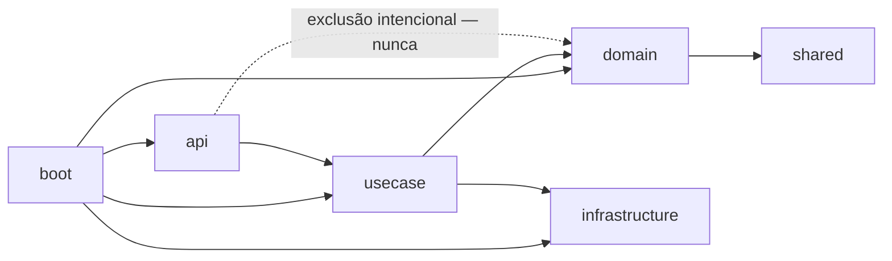

# Architecture Spine — SawCunhaOS Motor Fundacional (Etapa 1)

## Design Paradigm

DDD tático em camadas, já em vigor no monorepo e ratificado aqui, não reinventado:

- **`domain`** — entidades JPA (`internal/`), domain services (`specification/` interface + `service/XxxServiceBean`), repositórios. Regra que cruza entidades ou pertence ao próprio estado do agregado.
- **`usecase`** — orquestração: interface pública `XxxUseCase` + `XxxUseCaseBean` package-private `@Service`, mesmo pacote. Não decide regra, decide fluxo.
- **`api`** — `XxxDelegate implements XxxApiDelegate`, fino, sem regra de negócio, sem visibilidade de `domain` (exclusão de dependência intencional).
- **`infrastructure`** — cross-cutting (permissões, enums transversais).
- **`boot` / `grpc-boot`** — dois composition roots empacotados/executáveis dentro de `organization/`: `flow-organization-boot` (`ScosOrganizationApplication`, API REST) e `flow-organization-grpc-boot` (`ScosOrganizationGrpcApplication`, servidor gRPC). Tudo desta Etapa (Kill Switch, turno, aprovação) vive no lado REST (`flow-organization-boot`); `grpc-boot` fica fora do escopo desta spine.
- **`server-fat`** (raiz do monorepo, irmão de `organization/`) — módulo separado com sua própria `@SpringBootApplication` (`ScosFlowApplication`), importa `organization` via BOM e empacota um fat-jar próprio (`spring-cloud-starter-config`/`-bootstrap`). Existem hoje também módulos-esqueleto vazios `notification/` e `geotemporal/` (0 classes Java, só `pom.xml`) — reserva de espaço pras Etapas 2/3. `[OPEN QUESTION: qual dos três é o deployável real de produção — server-fat agregando tudo, ou flow-organization-boot standalone? Esta spine não resolve isso; até decidir, trate os dois como coexistentes e não remova nenhum.]`

Mapeamento de pacote inalterado: `br.com.sawcunhaos.organization.*`. Módulos hoje vivem em `organization/flow-organization-{domain,usecase,api,infrastructure,boot,grpc-boot,grpc-proto,resources,shared}` + `organization/flow-security-starter` (renomeados de `scos-organization-*`/`flow-security-starter` para monólito modular — reestruturação já concluída, não é decisão desta spine).



## Invariants & Rules

### AD-1 — Kill Switch via denylist Redis, Keycloak em paralelo [ADOPTED]

- **Binds:** FR-13, FR-14
- **Prevents:** um builder trocar validação de JWT local (stateless, já em uso) por introspecção remota a cada request; ou dois builders divergirem em quando o Redis é escrito e o que fazer se essa escrita falhar.
- **Rule:** invalidação é um denylist em Redis (chave `jti` ou `loginId`, TTL = validade restante do token). A escrita no Redis é **síncrona, na mesma thread da requisição, imediatamente após o commit da transição de status** — nunca fire-and-forget assíncrono; a API só responde sucesso ao chamador (RH) depois de tentar essa escrita. Se a escrita falhar, o commit do banco **permanece válido** (RH nunca é bloqueado) e o Use Case aciona o retry automático + alerta obrigatório de FR-13 na mesma operação. Chamada à Keycloak Admin API acontece em paralelo (mata a sessão lá também), mas **nunca é o mecanismo que barra a requisição** — só o Redis é. **Lado da leitura:** se o filtro de autenticação não conseguir consultar o Redis por qualquer motivo (indisponibilidade, timeout), a requisição é **negada por padrão** (fail-closed) — nunca liberada por "não consegui verificar". Reativação (FR-14) nunca restaura uma entrada já removida do denylist antes de sua expiração natural.

### AD-2 — Bloqueio de turno como Filter pós-autenticação, ancorado entre JWT e jDempotent [ADOPTED]

- **Binds:** FR-9, FR-10, FR-12
- **Prevents:** implementação via AOP/aspecto de método (mecanismo novo, ordem relativa à cadeia de segurança não garantida); ou dois builders registrando o filtro em posições diferentes da chain (antes/depois do filtro de idempotência), fazendo uma requisição bloqueada por turno consumir ou não uma chave de idempotência de forma inconsistente.
- **Rule:** um `Filter` novo (`ShiftEnforcementFilter`) é registrado via `addFilterAfter` do filtro de autenticação JWT **e** `addFilterBefore` do filtro de idempotência (jDempotent) — âncora dupla explícita, não só "depois da autenticação, antes do controller". Uma requisição negada por turno nunca chega a consumir uma chave de idempotência. Mesma família de mecanismo do único precedente hoje (`ExceptionHandlerFilter`), só muda a posição.

### AD-3 — Filtro de turno mora no app, não na lib compartilhada [ADOPTED]

- **Binds:** FR-9, FR-10, FR-12
- **Prevents:** lógica de negócio específica (Employee, Work Schedule) vazar para dentro de `flow-security-starter`, que é biblioteca reusável entre projetos SCOS.
- **Rule:** o `Filter` de turno vive em `flow-organization-infrastructure`/`boot`, registrado no ponto de extensão que `flow-security-starter` expõe — nunca dentro do próprio starter.

### AD-4 — Aprovação de acesso como entidade própria, não estado avulso no Login [ADOPTED]

- **Binds:** FR-23, FR-24, FR-25, FR-26, FR-27, FR-28
- **Prevents:** um builder empilhar colunas de SLA/nível-de-cadeia/escalonamento direto no `Login` ou tentar espremer esse estado em `LoginStatusHistory` — que é log de transição simples, não máquina de estado temporal; dois builders sincronizando `Login`/`LoginApprovalRequest` de formas diferentes (uma síncrona, outra por evento) e abrindo uma janela onde os dois discordam; dois builders resolvendo o nível inicial da cadeia de forma diferente quando não há supervisor nem gerente; a política de expiração de FR-28 (cancelamento automático) se confundir com o escalonamento indefinido de FR-23/24/26/27; um builder tratando `REQUESTED_BY_LOGIN_ID` nulo como bug em vez de "solicitação do sistema" (FR-28) e quebrando com NPE; e dois builders divergindo sobre quem recalcula `SLA_DEADLINE` e quando, ao escalonar de nível.
- **Rule:**
  - Nova entidade `LoginApprovalRequest` (FK para `Login`) guarda solicitante (`REQUESTED_BY_LOGIN_ID`, **nullable — `NULL` significa exclusivamente "solicitação aberta pelo sistema", FR-28; correlacionado por CHECK de banco com `escalationPolicy=AUTO_CANCEL`, nunca deixado à interpretação do código de leitura**), nível atual da cadeia (`CURRENT_LEVEL`: `SUPERVISOR`/`MANAGER`/`SYSTEM_ACCESS_GROUP`), `SLA_DEADLINE`, uma flag `IS_EXCEPTION_SELF_APPROVAL` (marca a auto-aprovação de última instância, nunca omitida — base da métrica SM-6), e um campo `ESCALATION_POLICY` (`INDEFINITE` para solicitação aberta por pessoa — FR-23/24/25/26/27 — ou `AUTO_CANCEL` com prazo, para a reativação automática de licença/férias — FR-28). Vocabulário de todas as colunas de enum é **sempre em inglês** — código e schema são inglês por convenção do projeto (`project-context.md`); rótulos em PT-BR só existem em diagrama/mensagem ao usuário, nunca no valor persistido.
  - `Login.status` (enum real: **`LoginStatus`**, não "StatusLogin") ganha `PENDING_APPROVAL`/`REJECTED` **só como visibilidade grosseira** — sincronizado pelo **mecanismo já existente**: o Use Case que decide (cria, aprova, rejeita, cancela) um `LoginApprovalRequest` grava, **na mesma transação**, (1) o novo `STATUS` em `LoginApprovalRequest` e (2) uma linha em `SCOS_LOGIN_STATUS_HISTORY` com o `LoginStatus` correspondente — é esse INSERT explícito, feito pelo Use Case, que aciona o trigger de banco já existente (`trg_sync_login_status`/`fn_sync_login_status`), atualizando `SCOS_LOGIN.status` automaticamente. **Não existe nenhum trigger conectando `SCOS_LOGIN_APPROVAL_REQUEST` diretamente a `SCOS_LOGIN_STATUS_HISTORY` ou a `SCOS_LOGIN`** — a ponte é sempre código de aplicação, nunca banco; um builder que só atualiza `LoginApprovalRequest.STATUS` via query nativa, sem o INSERT correspondente, deixa `Login.status` permanentemente dessincronizado.
  - **Nível inicial (t=0, na criação da solicitação):** resolvido imediatamente percorrendo a cadeia Supervisor → Gerente → Grupo de Sistema, pousando no primeiro nível presente e sem conflito de interesse com o solicitante — não espera um SLA fictício de um nível que nunca existiu. Reavaliação posterior só acontece por estouro de SLA, nunca por mudança de organograma depois de a solicitação já estar aberta.
  - **Recálculo de `SLA_DEADLINE` na escalada:** é responsabilidade exclusiva do job agendado que varre `LoginApprovalRequest` pendentes com `SLA_DEADLINE` vencida (mesmo índice parcial que resolve essas linhas). Esse job, **numa única transação por solicitação**, atualiza `CURRENT_LEVEL` para o próximo nível, recalcula `SLA_DEADLINE = now() + janela do novo nível`, e grava o timestamp de escalonamento correspondente (`MANAGER_ESCALATED_AT`/`SYSTEM_GROUP_ESCALATED_AT`) — nunca em passos separados que deixem a linha momentaneamente inconsistente (nível novo com prazo velho, ou vice-versa).

```mermaid
stateDiagram-v2
  note right of [*]: Nomes de estado = valores literais das colunas CURRENT_LEVEL/STATUS (inglês, schema real) — não traduzir
  [*] --> SUPERVISOR: request created (nível inicial resolvido no ato)
  SUPERVISOR --> MANAGER: SLA estourado ou supervisor ausente/conflito
  MANAGER --> SYSTEM_ACCESS_GROUP: SLA estourado ou gerente ausente/conflito
  SYSTEM_ACCESS_GROUP --> SYSTEM_ACCESS_GROUP: SLA estourado, policy=INDEFINITE (renotifica)
  SUPERVISOR --> APPROVED
  MANAGER --> APPROVED
  SYSTEM_ACCESS_GROUP --> APPROVED
  SUPERVISOR --> REJECTED
  MANAGER --> REJECTED
  SYSTEM_ACCESS_GROUP --> REJECTED
  SUPERVISOR --> CANCELLED: SLA estourado, policy=AUTO_CANCEL (só FR-28)
  MANAGER --> CANCELLED: SLA estourado, policy=AUTO_CANCEL (só FR-28)
  APPROVED --> [*]
  REJECTED --> [*]
  CANCELLED --> [*]
```

### AD-5 — Gerente do Departamento via FK direta [ADOPTED]

- **Binds:** FR-23 (cadeia de aprovação, nível 2)
- **Prevents:** inventar um mecanismo de "cargo gerencial" (flag em Position + query derivada) quando o padrão já existente (`Employee.supervisor`, self-FK simples) resolve o mesmo problema de forma mais barata.
- **Rule:** `Department` ganha `managerId` (FK direta para `Employee`), mesmo padrão de `Employee.supervisor`. Um Departamento tem no máximo um gerente designado diretamente — não derivado de Cargo.

### AD-6 — Grupo de aprovação de sistema reusa Login→Profile→Resource, não cria mecanismo novo [ADOPTED]

- **Binds:** FR-26, FR-27, `APPROVE_SYSTEM_ACCESS`
- **Prevents:** construir uma tabela/mecanismo paralelo de "grupo de aprovadores" quando o modelo de permissão já existente já resolve isso; atribuir `APPROVE_SYSTEM_ACCESS` como Perfil adicional achando que já funciona, quando o bug conhecido de FR-7 (perfis adicionais não somam em `vw_login_context`) faz essa permissão nunca ser reconhecida em runtime.
- **Rule:** `APPROVE_SYSTEM_ACCESS` é um `Resource`/permissão comum. RH cria um `Profile` dedicado contendo esse Resource e atribui **como Perfil principal** aos Logins escolhidos — nunca como Perfil adicional enquanto o bug de `vw_login_context` (FR-7) não for corrigido; a correção da view é **pré-requisito de entrega** de AD-6, não item independente. Bootstrap dos primeiros membros é seed Liquibase (Profile + atribuição principal), mesmo padrão já usado para dados de semente.

### AD-7 — Verificação de filial ativa em toda a subárvore é CTE recursiva, não caminhada em Java [ADOPTED]

- **Binds:** FR-1, FR-2
- **Prevents:** dois builders implementando a checagem "existe filial ativa em qualquer nível abaixo" de formas incompatíveis em custo/comportamento — um com CTE recursiva no banco, outro carregando a árvore inteira em memória e caminhando em Java, um terceiro mantendo um materialized path/closure table só pra essa checagem. `CompanyServiceBean.depthOf()` hoje só resolve profundidade **subindo** (mãe→raiz) para o limite de `COMPANY_HIERARCHY_MAX_DEPTH`; não existe nenhum código que desça a árvore — este é trabalho novo, não uma extensão óbvia do que já existe.
- **Rule:** a checagem de "filial ativa em qualquer nível" (FR-2, `disable`/`block`) é uma **CTE recursiva em SQL** (`WITH RECURSIVE`), não uma caminhada client-side em Java nem uma estrutura denormalizada nova (closure table) — consistente com o resto do projeto, que já resolve consultas hierárquicas/de existência via QueryDSL e SQL, nunca carregando árvore inteira em memória. Vive como `default` method no repositório de Company, mesmo padrão de outras consultas dinâmicas do projeto.

## Consistency Conventions

| Concern | Convention |
| --- | --- |
| Naming (entidades, tabelas, permissões) | `SCOS_<ENTIDADE>` / `PK_SCOS_<T>` / `FK_<COL>_SCOS_<T>`; permissão `ACTION_RESOURCE` (ex. `APPROVE_LOGIN`); erro `SCOS_<MÓDULO>_<NNN>`. Já em vigor — não redefinido aqui. |
| Novas tabelas desta Etapa | `SCOS_LOGIN_APPROVAL_REQUEST`, `SCOS_SHIFT_ENFORCEMENT_LOG` (FR-11), coluna `DEPARTMENT.MANAGER_ID` (FK). |
| Bloqueio de DELETE físico | Toda tabela nova desta Etapa que registra decisão/histórico (`LoginApprovalRequest`, `ShiftEnforcementLog`) leva trigger `BEFORE DELETE` reaproveitando `fn_block_delete()` já existente (mesmo padrão de `SCOS_REASON_*`/Catalog/Outbox) — **só bloqueia DELETE, nunca UPDATE** (diferente do que uma leitura apressada da convenção poderia sugerir: `LoginApprovalRequest` precisa de UPDATE legítimo para escalonamento/decisão, AD-4; bloquear UPDATE quebraria o próprio fluxo). A lacuna hoje existente em `*_STATUS_HISTORY` (sem proteção física nenhuma, nem de DELETE) permanece um débito da Fundação, não desta Etapa. |
| Erros | `ScosException` + `ExceptionCodeError`; nunca `RuntimeException` cru. Códigos novos desta Etapa seguem a faixa `SCOS_LOGIN_0NN`/`SCOS_DEPARTMENT_0NN` livre. |
| Transações | `@Transactional(rollbackFor = ScosException.class)` em Use Case de escrita; a transição de status (Kill Switch, AD-1) **nunca** é revertida por falha do lado Redis/Keycloak — commit do banco é sempre a fonte de verdade. |

## Stack

*Seed — já pinado no repo (BOM `scos-bom:1.3.1`), não decisão nova desta rodada.*

| Name | Version |
| --- | --- |
| Java | 25 |
| Spring Boot / Framework | 4.X.X (via BOM) |
| PostgreSQL | 18+ |
| Redis | via BOM (jDempotent já em uso — reaproveitado pelo Kill Switch, AD-1) |
| Keycloak | já integrado (`flow-security-starter`) |
| Liquibase | changelogs em `flow-organization-resources` |
| MapStruct | 1.6.3 |

## Structural Seed

**Schema já implementado** (Liquibase, diretamente nas definições — projeto pré-produção, sem migração incremental):

```text
organization/flow-organization-resources/.../db/changelog/organization/
  v1.0.0/tables/
    scos_login_approval_request.yml   # NOVA tabela — AD-4
    scos_department_manager.yml       # ALTER: Department.MANAGER_ID (FK Employee) — AD-5
    scos_shift_enforcement_log.yml    # NOVA tabela — FR-11
  checks/checks.yml                   # ALTER: chk_login_status(_history) ganham PENDING_APPROVAL/REJECTED;
                                       #        checks novos de login_approval_request (+ correlação policy/requester)
                                       #        e de shift_enforcement_log
  triggers/trg_block_delete_login_approval_request.sql  # NOVO — reaproveita fn_block_delete()
  triggers/trg_block_delete_shift_enforcement_log.sql   # NOVO — reaproveita fn_block_delete()
  v1.0.0/indexes/login_approval_request.yml             # NOVO — índice de FK + índice parcial de varredura de SLA
```

**Java ainda por implementar** (fora do escopo desta spine — entra na quebra em stories):

```text
organization/
  flow-organization-domain/.../access/login/internal/
    Login.java                    # LoginStatus ganha PENDING_APPROVAL/REJECTED
    LoginApprovalRequest.java     # NOVO — AD-4
    LoginApprovalRequestRepository.java  # NOVO
  flow-organization-domain/.../corporate/department/internal/
    Department.java               # ganha managerId (FK Employee) — AD-5
  flow-organization-infrastructure/.../security/
    ShiftEnforcementFilter.java   # NOVO — AD-2, AD-3
  flow-security-starter/.../keycloak/
    (ponto de extensão da chain — sem lógica de turno aqui — AD-3)
```

## Capability → Architecture Map

| Capability / Área | Vive em | Governado por |
| --- | --- | --- |
| FR-1, FR-2 (cadastro/ciclo de vida de Empresa) | `flow-organization-{domain,usecase,api}/corporate/company` | Design Paradigm (CRUD+status já ratificado por Department/Position — sem AD nova); checagem de subárvore → AD-7 |
| FR-4 (validação cronológica de Jornada) | `PositionWorkSchedule`/`EmployeeWorkSchedule` | Bean Validation padrão — sem AD nova |
| FR-8 (classificação de Perfil + defasagem de view) | `Profile`, `vw_login_context`/`vw_authority_response` | Sem AD — ver Deferred (defasagem de até 30 min já é infraestrutura existente, não decisão nova desta Etapa) |
| FR-9/10/12 (bloqueio de turno) | `flow-organization-infrastructure` (Filter) | AD-2, AD-3 |
| FR-11 (auditoria imutável de turno) | `SCOS_SHIFT_ENFORCEMENT_LOG` (schema já implementado) | Convenção "Bloqueio de DELETE físico" |
| FR-13/14 (Kill Switch) | Redis (denylist) + chamada Keycloak Admin API | AD-1 |
| FR-23–25 (aprovação Login com Funcionário) | `LoginApprovalRequest`, nível `SUPERVISOR`/`MANAGER` | AD-4, AD-5 |
| FR-26–27 (Login órfão / Perfil) | `LoginApprovalRequest`, nível `SYSTEM_ACCESS_GROUP` | AD-4, AD-6 |
| FR-28 (licença/férias) | reaproveita `disable`/`enable` + `LoginApprovalRequest`, `escalationPolicy=AUTO_CANCEL` | AD-4 |

## Deferred

- **Motor Geotemporal (Etapa 2) e Motor de Notificação Híbrida (Etapa 3)** — arquitetura própria quando a etapa chegar; nenhuma decisão desta spine antecipa esses módulos.
- **SLA "1 dia útil" tratado como "1 dia corrido"** durante toda a Etapa 1 (depende de FR-17, Etapa 2) — já registrado no PRD §9, não repetido em AD aqui.
- **Defasagem de até 30 min nas views de autoridade (`vw_login_context`/`vw_authority_response`) para reclassificação de Perfil (FR-8)** — infraestrutura existente (`pg_cron`), fora do escopo desta Etapa mudar; se o negócio decidir que reclassificação de turno precisa de efeito imediato, isso é uma AD de uma rodada futura (invalidação ativa de cache), não desta.
- Backend concreto de fila para modo assíncrono de notificação, provedor de CEP/fallback, provedor de Email/SMS — pertencem à Etapa 2/3.
- Política de expiração/rotação da chave Redis usada no denylist do Kill Switch além do TTL básico (AD-1) — refinamento de operação, não estrutural.
- Envelope de deploy/infra (Redis/Keycloak/PostgreSQL) — já provisionado e em uso por outras features do monorepo; Etapa 1 não introduz infraestrutura nova, só reaproveita.
