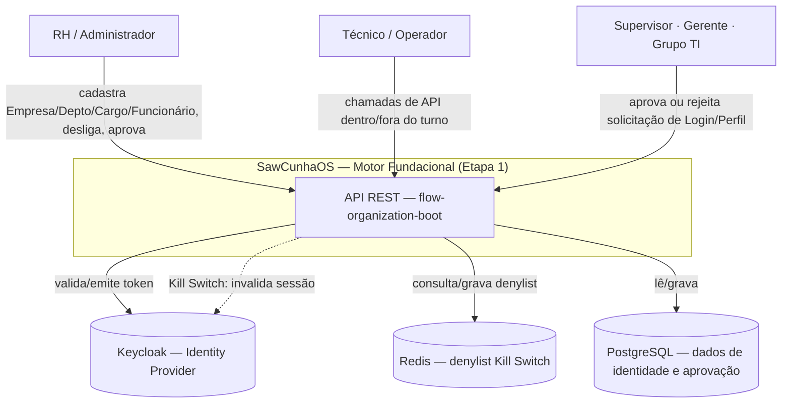
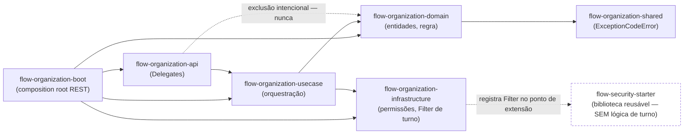
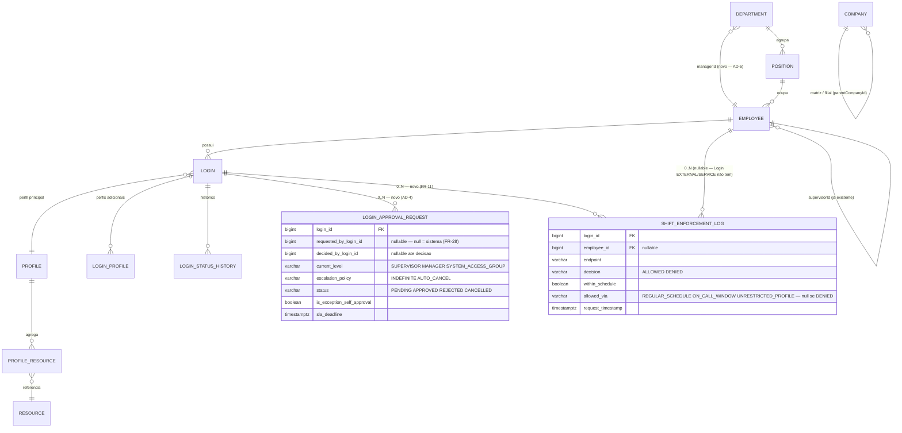
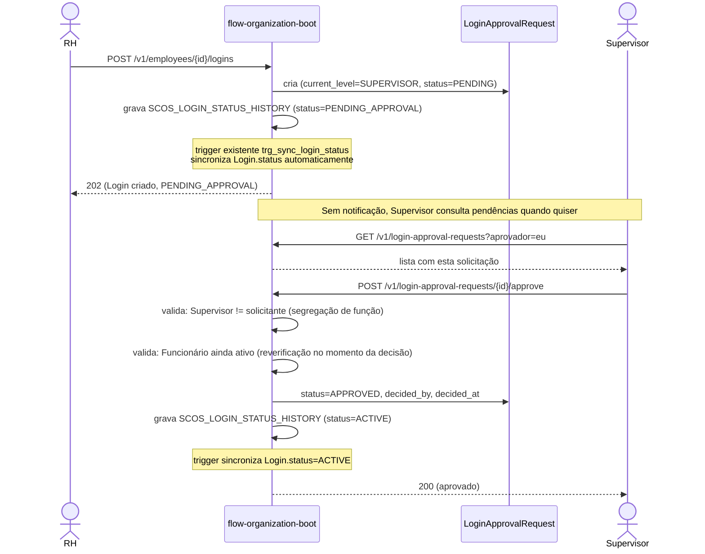
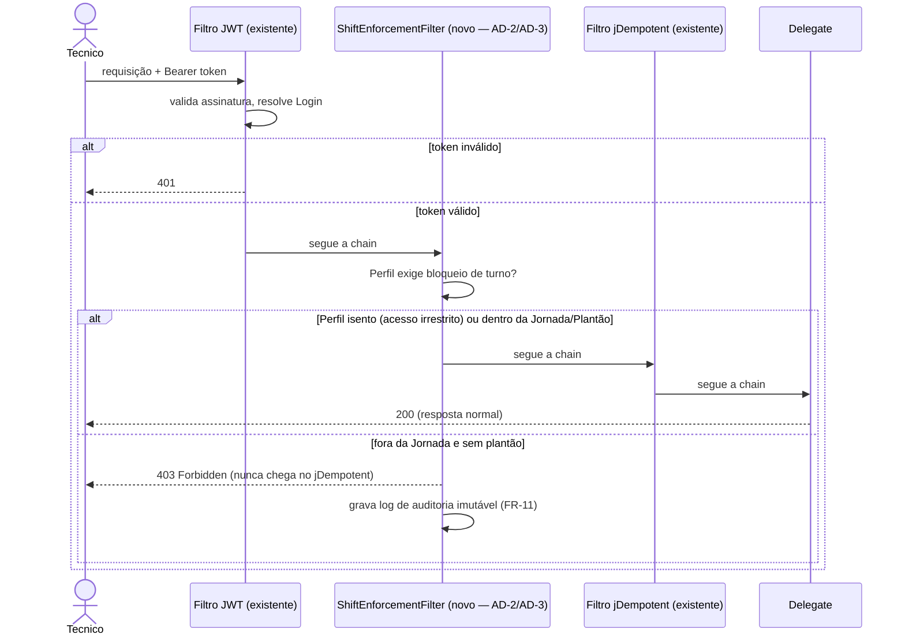
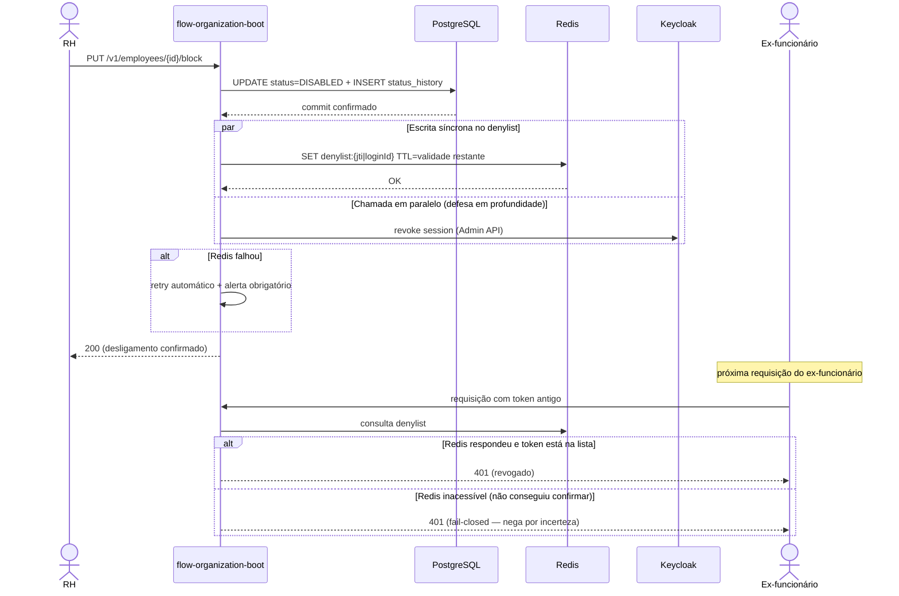
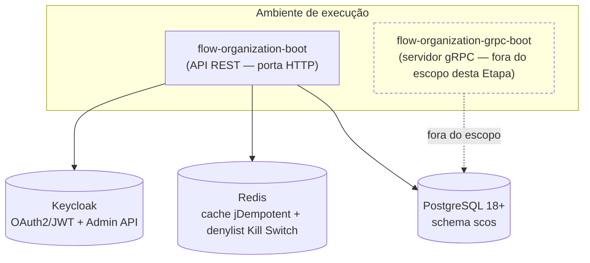

# Diagramas de Arquitetura — Etapa 1 (P0)

Companion visual de `_bmad-output/planning-artifacts/architecture/architecture-SawCunhaOS-Organization-2026-07-18/ARCHITECTURE-SPINE.md`. Cada diagrama tem um parágrafo de contexto em linguagem simples antes do Mermaid técnico — serve tanto para quem vai codar quanto para quem só precisa entender o desenho geral.

Escopo: só a Etapa 1 (Fundação, Governança de Turno, Kill Switch). Motor Geotemporal e Notificação Híbrida (Etapas 2 e 3) não aparecem aqui — ver `Deferred` na spine.

## 1. Contexto — quem interage com o sistema

RH cadastra e desliga gente; o Técnico é quem sofre o bloqueio de turno; Supervisor/Gerente/Grupo de TI aprovam acesso; Keycloak e Redis são os dois sistemas externos que a Etapa 1 já usa hoje, sem infraestrutura nova.



## 2. Módulos e dependências

A regra de dependência é uma via de mão única: `api` nunca enxerga `domain` diretamente — quem traduz é o `usecase`. `flow-security-starter` é biblioteca reusável entre projetos SCOS; por isso a lógica de bloqueio de turno (específica deste produto) mora em `flow-organization-infrastructure`, não dentro do starter (AD-3).



## 3. Modelo de dados — Etapa 1

Foco nas entidades e relações que a Etapa 1 usa ou adiciona. `LoginApprovalRequest` é a peça nova central (AD-4); `Department.managerId` fecha o nível 2 da cadeia de aprovação (AD-5); `Employee.supervisor` já existia. Atributo que é ele mesmo uma decisão de arquitetura (ex. `escalationPolicy`) tem explicação na spine, não aqui — este diagrama só mostra nomes e relações.



## 4. Fluxo — criação e aprovação de Login

Ninguém precisa ser avisado pra o fluxo funcionar: o aprovador pode consultar a lista de pendências a qualquer momento (decisão que resolveu a inversão de prioridade entre FR-23 e o Motor de Notificação, P2). A notificação, quando existir, é reforço — não pré-requisito.



## 5. Fluxo — bloqueio de turno (Zero Trust)

O filtro novo entra depois de saber quem é o usuário (JWT já validado) e antes de qualquer efeito de negócio — inclusive antes do filtro de idempotência, pra uma chamada barrada nunca consumir uma chave de idempotência à toa (AD-2).



## 6. Fluxo — Kill Switch

O commit no banco nunca espera o Redis. Se a escrita no denylist falhar, o Use Case aciona retry/alerta — e enquanto não propagar, qualquer checagem que não confirmar o estado nega por padrão (fail-closed), nunca libera por incerteza.



## 7. Máquina de estados — LoginApprovalRequest

`Cancelado` só existe na política `AUTO_CANCEL` (retorno automático de licença/férias, FR-28) — o escalonamento indefinido (FR-23/24/25/26/27) nunca cancela sozinho, só renotifica.

```mermaid
stateDiagram-v2
  note right of [*]: Estados = valores literais de CURRENT_LEVEL/STATUS no schema (inglês) — não traduzir no código
  [*] --> SUPERVISOR: request created — nível inicial resolvido no ato
  SUPERVISOR --> MANAGER: SLA estourado ou supervisor ausente/conflito
  MANAGER --> SYSTEM_ACCESS_GROUP: SLA estourado ou gerente ausente/conflito
  SYSTEM_ACCESS_GROUP --> SYSTEM_ACCESS_GROUP: SLA estourado, policy=INDEFINITE (renotifica)

  SUPERVISOR --> APPROVED
  MANAGER --> APPROVED
  SYSTEM_ACCESS_GROUP --> APPROVED
  SUPERVISOR --> REJECTED
  MANAGER --> REJECTED
  SYSTEM_ACCESS_GROUP --> REJECTED
  SUPERVISOR --> CANCELLED: SLA estourado, policy=AUTO_CANCEL (só FR-28)
  MANAGER --> CANCELLED: SLA estourado, policy=AUTO_CANCEL (só FR-28)

  APPROVED --> [*]
  REJECTED --> [*]
  CANCELLED --> [*]
```

## 8. Deploy e infraestrutura

Nada disto é novo — Redis, Keycloak e PostgreSQL já estão provisionados e em uso por outras partes do sistema hoje. A Etapa 1 reaproveita, não adiciona.



---

*Fonte de verdade das decisões: `ARCHITECTURE-SPINE.md` (AD-1 a AD-6). Este arquivo é ilustração — se um diagrama e a spine discordarem, a spine vence.*
