## Domain Model

```mermaid
erDiagram

%% ─── ORGANIZAÇÃO ────────────────────────────────────────────────────────

    SCOS_DEPARTMENT  ||--o{ SCOS_POSITION         : "0..* positions"
    SCOS_POSITION    ||--o{ SCOS_EMPLOYEE          : "0..* employees"
    SCOS_COMPANY     ||--o{ SCOS_EMPLOYEE          : "0..* employees"
    SCOS_EMPLOYEE    |o--o{ SCOS_EMPLOYEE          : "supervisor"
    SCOS_EMPLOYEE    ||--o{ SCOS_EMPLOYEE_CONTACT  : "0..* contacts"
    SCOS_EMPLOYEE    ||--o{ SCOS_EMPLOYEE_ADDRESS  : "0..* addresses"
    SCOS_COMPANY     ||--o{ SCOS_COMPANY_CONTACT   : "0..* contacts"
    SCOS_COMPANY     ||--o{ SCOS_COMPANY_ADDRESS   : "0..* addresses"
    SCOS_COMPANY     ||--o{ SCOS_COMPANY           : "0..* branches"

%% ─── ACESSO E PERMISSÕES ─────────────────────────────────────────────────

    SCOS_PROFILE     ||--o{ SCOS_LOGIN             : "0..* logins"
    SCOS_EMPLOYEE    |o--o{ SCOS_LOGIN             : "0..* logins"
    SCOS_SYSTEM      ||--o{ SCOS_RESOURCE          : "0..* resources"
    SCOS_PROFILE     ||--o{ SCOS_PROFILE_RESOURCE  : "0..* permissions"
    SCOS_RESOURCE    ||--o{ SCOS_PROFILE_RESOURCE  : "0..* profiles"

%% ─── INTEGRAÇÃO KEYCLOAK ─────────────────────────────────────────────────

    SCOS_INTEGRATION_KEYCLOAK ||--o{ SCOS_INTEGRATION_KEYCLOAK_LOG : "0..* logs"

%% ─── TABELAS ─────────────────────────────────────────────────────────────

    SCOS_DEPARTMENT {
        BIGINT         DEPARTMENT_ID PK
        VARCHAR(30)    CODE          UK  "NOT NULL"
        VARCHAR(255)   DESCRIPTION       "NOT NULL"
        BOOLEAN        ACTIVE            "NOT NULL DEFAULT TRUE"
        TIMESTAMPTZ  CREATED_AT        "NOT NULL"
        TIMESTAMPTZ  UPDATED_AT        "NOT NULL"
        VARCHAR(255)   USER_AT           "NOT NULL"
    }

    SCOS_POSITION {
        BIGINT         POSITION_ID   PK
        BIGINT         DEPARTMENT_ID FK  "NOT NULL"
        VARCHAR(30)    CODE          UK  "NOT NULL"
        VARCHAR(30)    DESCRIPTION       "NOT NULL"
        BOOLEAN        ACTIVE            "NOT NULL DEFAULT TRUE"
        TIMESTAMPTZ  CREATED_AT        "NOT NULL"
        TIMESTAMPTZ  UPDATED_AT        "NOT NULL"
        VARCHAR(255)   USER_AT           "NOT NULL"
    }

    SCOS_EMPLOYEE {
        BIGINT         EMPLOYEE_ID     PK
        BIGINT         SUPERVISOR_ID   FK  "NULL"
        BIGINT         POSITION_ID     FK  "NOT NULL"
        BIGINT         COMPANY_ID      FK  "NOT NULL"
        VARCHAR(250)   NAME                "NOT NULL"
        VARCHAR(100)   NAME_TREATMENT      "NOT NULL"
        VARCHAR(11)    TAX_IDENTIFIER  UK  "NOT NULL --CPF"
        VARCHAR(255)   EMAIL           UK  "NOT NULL"
        DATE      BIRTH_DATE          "NOT NULL"
        DATE      DATE_OF_HIRING      "NOT NULL"
        TEXT           OBSERVATION
        VARCHAR(20)    STATUS              "NOT NULL --ACTIVE/INACTIVE/DISABLED"
        TIMESTAMPTZ  CREATED_AT          "NOT NULL"
        TIMESTAMPTZ  UPDATED_AT          "NOT NULL"
        VARCHAR(255)   USER_AT             "NOT NULL"
    }

    SCOS_EMPLOYEE_CONTACT {
        BIGINT         EMPLOYEE_ID_CONTACT PK
        BIGINT         EMPLOYEE_ID         FK  "NOT NULL"
        VARCHAR(50)    PHONE               UK  "NOT NULL"
        VARCHAR(50)    TYPE                UK  "NOT NULL"
        TIMESTAMPTZ  CREATED_AT              "NOT NULL"
        TIMESTAMPTZ  UPDATED_AT              "NOT NULL"
        VARCHAR(255)   USER_AT                 "NOT NULL"
    }

    SCOS_EMPLOYEE_ADDRESS {
        BIGINT          EMPLOYEE_ID_ADDRESS PK    "external reference -- no FK"
        BIGINT          EMPLOYEE_ID         PK,FK
        VARCHAR(50)     TYPE                UK    "NOT NULL"
        INT             NUMBER                    "NOT NULL"
        VARCHAR(250)    COMPLEMENT
        POINT GEOLOCATION               "NOT NULL"
        TIMESTAMPTZ   CREATED_AT                "NOT NULL"
        TIMESTAMPTZ   UPDATED_AT                "NOT NULL"
        VARCHAR(255)    USER_AT                   "NOT NULL"
    }

    SCOS_COMPANY {
        BIGINT         COMPANY_ID         PK
        BIGINT         PARENT_COMPANY_ID  FK  "NULL --NULL = matriz"
        VARCHAR(250)   NAME                   "NOT NULL"
        VARCHAR(100)   NAME_TREATMENT         "NOT NULL"
        VARCHAR(14)    TAX_IDENTIFIER     UK  "NOT NULL --CNPJ"
        DATE      FOUNDATION_DATE        "NOT NULL"
        VARCHAR(100)   SECTOR_OF_ACTIVITY     "NOT NULL"
        TEXT           OBSERVATION
        VARCHAR(20)    STATUS                 "NOT NULL --ACTIVE/INACTIVE/DISABLED"
        TIMESTAMPTZ  CREATED_AT             "NOT NULL"
        TIMESTAMPTZ  UPDATED_AT             "NOT NULL"
        VARCHAR(255)   USER_AT                "NOT NULL"
    }

    SCOS_COMPANY_ADDRESS {
        BIGINT          COMPANY_ID_ADDRESS PK    "external reference -- no FK"
        BIGINT          COMPANY_ID         PK,FK
        VARCHAR(50)     TYPE               UK    "NOT NULL"
        INT             NUMBER                   "NOT NULL"
        VARCHAR(250)    COMPLEMENT               "NULL"
        POINT GEOLOCATION              "NOT NULL"
        TIMESTAMPTZ   CREATED_AT               "NOT NULL"
        TIMESTAMPTZ   UPDATED_AT               "NOT NULL"
        VARCHAR(255)    USER_AT                  "NOT NULL"
    }

    SCOS_COMPANY_CONTACT {
        BIGINT         COMPANY_ID_CONTACT  PK
        BIGINT         COMPANY_ID          FK  "NOT NULL"
        VARCHAR(50)    PHONE               UK  "NOT NULL"
        VARCHAR(255)   EMAIL               UK  "NOT NULL"
        VARCHAR(50)    TYPE                UK  "NOT NULL"
        VARCHAR(255)   RESPONSIBLE_PERSON      "NOT NULL"
        TIMESTAMPTZ  CREATED_AT              "NOT NULL"
        TIMESTAMPTZ  UPDATED_AT              "NOT NULL"
        VARCHAR(255)   USER_AT                 "NOT NULL"
    }

    SCOS_PROFILE {
        BIGINT         PROFILE_ID  PK
        VARCHAR(30)    CODE        UK  "NOT NULL"
        VARCHAR(255)   DESCRIPTION     "NOT NULL"
        BOOLEAN        ACTIVE          "NOT NULL DEFAULT TRUE"
        TIMESTAMPTZ  CREATED_AT      "NOT NULL"
        TIMESTAMPTZ  UPDATED_AT      "NOT NULL"
        VARCHAR(255)   USER_AT         "NOT NULL"
    }

    SCOS_LOGIN {
        BIGINT         LOGIN_ID     PK
        BIGINT         PROFILE_ID   FK  "NOT NULL"
        BIGINT         EMPLOYEE_ID  FK  "NULL"
        UUID           KEYCLOAK_ID      "NULL"
        VARCHAR(255)   LOGIN            "NOT NULL"
        VARCHAR(50)    STATUS           "NOT NULL --ACTIVE/INACTIVE/BLOCKED"
        VARCHAR(50)    TYPE             "NOT NULL --EMPLOYEE/EXTERNAL/SERVICE"
        TIMESTAMPTZ  CREATED_AT       "NOT NULL"
        TIMESTAMPTZ  UPDATED_AT       "NOT NULL"
        VARCHAR(255)   USER_AT          "NOT NULL"
    }

    SCOS_CONFIGURATION {
        VARCHAR(50)    CONFIGURATION_ID PK
        TEXT           VALUE               "NOT NULL"
        VARCHAR(50)    TYPE                "NOT NULL"
        TIMESTAMPTZ  CREATED_AT          "NOT NULL"
        TIMESTAMPTZ  UPDATED_AT          "NOT NULL"
        VARCHAR(255)   USER_AT             "NOT NULL"
    }

    SCOS_SYSTEM {
        UUID           SYSTEM_ID    PK
        VARCHAR(250)   NAME             "NOT NULL"
        VARCHAR(25)    CODE         UK  "NOT NULL"
        VARCHAR(200)   DESCRIPTION      "NOT NULL"
        TEXT           SECRET_KEY       "NOT NULL"
        VARCHAR(50)    STATUS           "NOT NULL --ACTIVE/INACTIVE"
        VARCHAR(50)    VERSION          "NOT NULL"
        TIMESTAMPTZ    CREATED_AT       "NOT NULL"
        TIMESTAMPTZ    UPDATED_AT       "NOT NULL"
        VARCHAR(255)   USER_AT          "NOT NULL"
    }

    SCOS_RESOURCE {
        UUID           RESOURCE_ID  PK
        UUID           SYSTEM_ID    FK  "NOT NULL"
        VARCHAR(50)    CODE         UK  "NOT NULL"
        VARCHAR(255)   DESCRIPTION_PT   "NOT NULL"
        VARCHAR(255)   DESCRIPTION_EN   "NOT NULL"
        BOOLEAN        ACTIVE           "NOT NULL DEFAULT TRUE"
        TIMESTAMPTZ    CREATED_AT       "NOT NULL"
        TIMESTAMPTZ    UPDATED_AT       "NOT NULL"
        VARCHAR(255)   USER_AT          "NOT NULL"
    }

    SCOS_PROFILE_RESOURCE {
        BIGINT         PROFILE_ID   PK,FK  "NOT NULL"
        UUID           RESOURCE_ID  PK,FK  "NOT NULL"
        TIMESTAMPTZ  CREATED_AT          "NOT NULL"
        VARCHAR(255)   USER_AT             "NOT NULL"
    }

    SCOS_INTEGRATION_KEYCLOAK {
        UUID           INTEGRATION_KEYCLOAK_ID  PK
        UUID           KEYCLOAK_ID                  "NULL --preenchido após criação no Keycloak"
        VARCHAR(255)   REALM                        "NOT NULL"
        VARCHAR(255)   EMAIL                        "NOT NULL"
        VARCHAR(255)   USERNAME                     "NOT NULL"
        VARCHAR(255)   REQUESTING                   "NOT NULL"
        VARCHAR(25)    TYPE                         "NOT NULL"
        VARCHAR(25)    STATUS                       "NOT NULL"
        TIMESTAMPTZ    DATE_START                   "NULL"
        TIMESTAMPTZ    DATE_END                     "NULL"
        VARCHAR(2500)  MESSAGE                      "NULL"
        JSONB          REQUEST                      "NOT NULL"
        INT            RETRY_COUNT                  "NOT NULL DEFAULT 0"
        INT            MAX_RETRIES                  "NOT NULL DEFAULT 3"
        TIMESTAMPTZ    CREATED_AT                   "NOT NULL DEFAULT NOW()"
        TIMESTAMPTZ    UPDATED_AT                   "NULL"
        VARCHAR(100)   USER_AT                      "NULL"
    }

    SCOS_INTEGRATION_KEYCLOAK_LOG {
        UUID           INTEGRATION_KEYCLOAK_LOG_ID  PK
        UUID           INTEGRATION_KEYCLOAK_ID      FK  "NOT NULL"
        BOOLEAN        SUCCESS                          "NOT NULL"
        VARCHAR(5000)  RESPONSE                        "NULL"
        TIMESTAMPTZ    CREATED_AT                      "NOT NULL DEFAULT NOW() --imutável"
        VARCHAR(100)   USER_AT                         "NULL"
    }

    SCOS_INTEGRATION_MESSAGE_INVALID {
        UUID           INTEGRATION_MESSAGE_INVALID_ID  PK
        VARCHAR(5000)  MESSAGE_INVALID                     "NOT NULL"
        TIMESTAMPTZ    CREATED_AT                          "NOT NULL DEFAULT NOW() --imutável"
        VARCHAR(100)   USER_AT                             "NULL"
    }
```

---

## Descrição das Tabelas

---

### SCOS_DEPARTMENT

**Descrição:** Representa os departamentos da empresa. Um departamento agrupa cargos relacionados a uma mesma área de atuação, como Recursos Humanos, Tecnologia ou Financeiro.

| Campo | Tipo | Restrição | Descrição |
|---|---|---|---|
| DEPARTMENT_ID | BIGINT | PK | Identificador único do departamento, gerado automaticamente |
| CODE | VARCHAR(30) | UK, NOT NULL | Código único do departamento — ex: `RH`, `TI`, `FIN` |
| DESCRIPTION | VARCHAR(30) | NOT NULL | Descrição completa do departamento |
| ACTIVE | BOOLEAN | NOT NULL, DEFAULT TRUE | Indica se o departamento está ativo. Departamentos inativos mantêm o histórico mas não aparecem para seleção |
| CREATED_AT | TIMESTAMPTZ | NOT NULL | Data e hora em que o registro foi criado |
| UPDATED_AT | TIMESTAMPTZ | NOT NULL | Data e hora da última atualização do registro |
| USER_AT | VARCHAR(255) | NOT NULL | Login do usuário que realizou a última alteração |

---

### SCOS_POSITION

**Descrição:** Representa os cargos existentes dentro de cada departamento. Um cargo define a função que um funcionário exerce. Cada cargo pertence a exatamente um departamento.

| Campo | Tipo | Restrição | Descrição |
|---|---|---|---|
| POSITION_ID | BIGINT | PK | Identificador único do cargo, gerado automaticamente |
| DEPARTMENT_ID | BIGINT | FK, NOT NULL | Referência ao departamento ao qual este cargo pertence |
| CODE | VARCHAR(30) | UK, NOT NULL | Código único do cargo — ex: `ANALISTA_SR`, `GERENTE_TI` |
| DESCRIPTION | VARCHAR(30) | NOT NULL | Descrição completa do cargo |
| ACTIVE | BOOLEAN | NOT NULL, DEFAULT TRUE | Indica se o cargo está ativo. Cargos inativos não podem ser atribuídos a novos funcionários |
| CREATED_AT | TIMESTAMPTZ | NOT NULL | Data e hora em que o registro foi criado |
| UPDATED_AT | TIMESTAMPTZ | NOT NULL | Data e hora da última atualização do registro |
| USER_AT | VARCHAR(255) | NOT NULL | Login do usuário que realizou a última alteração |

---

### SCOS_EMPLOYEE

**Descrição:** Representa os funcionários da empresa. Sempre vinculado a um cargo e a uma empresa ou filial. O campo `SUPERVISOR_ID` é uma auto-referência que monta a hierarquia organizacional — o funcionário no topo não possui supervisor e o campo fica nulo.

| Campo | Tipo | Restrição | Descrição |
|---|---|---|---|
| EMPLOYEE_ID | BIGINT | PK | Identificador único do funcionário, gerado automaticamente |
| SUPERVISOR_ID | BIGINT | FK, NULL | Referência ao funcionário supervisor direto. Nulo indica o topo da hierarquia |
| POSITION_ID | BIGINT | FK, NOT NULL | Referência ao cargo do funcionário |
| COMPANY_ID | BIGINT | FK, NOT NULL | Referência à empresa ou filial onde o funcionário trabalha |
| NAME | VARCHAR(250) | NOT NULL | Nome completo conforme documento oficial |
| NAME_TREATMENT | VARCHAR(100) | NOT NULL | Nome de tratamento — nome preferido ou apelido usado no dia a dia |
| TAX_IDENTIFIER | VARCHAR(11) | UK, NOT NULL | CPF do funcionário — identificador fiscal único |
| EMAIL | VARCHAR(255) | UK, NOT NULL | E-mail corporativo do funcionário |
| BIRTH_DATE | DATE | NOT NULL | Data de nascimento |
| DATE_OF_HIRING | DATE | NOT NULL | Data de contratação — início do vínculo empregatício |
| OBSERVATION | TEXT | NULL | Observações gerais sobre o funcionário. Campo livre |
| STATUS | VARCHAR(20) | NOT NULL | Situação atual: `ACTIVE`, `INACTIVE` ou `DISABLED` |
| CREATED_AT | TIMESTAMPTZ | NOT NULL | Data e hora em que o registro foi criado |
| UPDATED_AT | TIMESTAMPTZ | NOT NULL | Data e hora da última atualização do registro |
| USER_AT | VARCHAR(255) | NOT NULL | Login do usuário que realizou a última alteração |

---

### SCOS_EMPLOYEE_CONTACT

**Descrição:** Armazena os contatos telefônicos do funcionário. Um funcionário pode ter múltiplos contatos de diferentes tipos.

| Campo | Tipo | Restrição | Descrição |
|---|---|---|---|
| EMPLOYEE_ID_CONTACT | BIGINT | PK | Identificador único do contato, gerado automaticamente |
| EMPLOYEE_ID | BIGINT | FK, NOT NULL | Referência ao funcionário dono do contato |
| PHONE | VARCHAR(50) | UK, NOT NULL | Número de telefone com DDD |
| TYPE | VARCHAR(50) | UK, NOT NULL | Tipo do contato — ex: `MOBILE`, `WORK`, `HOME` |
| CREATED_AT | TIMESTAMPTZ | NOT NULL | Data e hora em que o registro foi criado |
| UPDATED_AT | TIMESTAMPTZ | NOT NULL | Data e hora da última atualização do registro |
| USER_AT | VARCHAR(255) | NOT NULL | Login do usuário que realizou a última alteração |

---

### SCOS_EMPLOYEE_ADDRESS

**Descrição:** Armazena os endereços do funcionário por referência a um sistema externo. O ID do endereço vem de fora — não é gerado aqui. A chave composta garante que o mesmo endereço externo não seja vinculado duas vezes ao mesmo funcionário. A integridade do `EMPLOYEE_ID_ADDRESS` é responsabilidade da aplicação.

| Campo | Tipo | Restrição | Descrição |
|---|---|---|---|
| EMPLOYEE_ID_ADDRESS | BIGINT | PK | ID do endereço no sistema externo. Sem FK — integridade garantida pela aplicação |
| EMPLOYEE_ID | BIGINT | PK, FK | Referência ao funcionário. Forma chave composta com `EMPLOYEE_ID_ADDRESS` |
| TYPE | VARCHAR(50) | UK, NOT NULL | Tipo do endereço — ex: `HOME`, `WORK` |
| NUMBER | INT | NOT NULL | Número do endereço |
| COMPLEMENT | VARCHAR(250) | NULL | Complemento — apartamento, bloco, sala etc |
| GEOLOCATION | POINT | NOT NULL | Coordenadas geográficas — latitude e longitude |
| CREATED_AT | TIMESTAMPTZ | NOT NULL | Data e hora em que o registro foi criado |
| UPDATED_AT | TIMESTAMPTZ | NOT NULL | Data e hora da última atualização do registro |
| USER_AT | VARCHAR(255) | NOT NULL | Login do usuário que realizou a última alteração |

---

### SCOS_COMPANY

**Descrição:** Representa tanto a empresa matriz quanto suas filiais. A auto-referência via `PARENT_COMPANY_ID` estrutura a hierarquia — nulo indica matriz, preenchido indica filial.

| Campo | Tipo | Restrição | Descrição |
|---|---|---|---|
| COMPANY_ID | BIGINT | PK | Identificador único da empresa, gerado automaticamente |
| PARENT_COMPANY_ID | BIGINT | FK, NULL | Referência à empresa mãe. Nulo indica que é a matriz |
| NAME | VARCHAR(250) | NOT NULL | Razão social da empresa |
| NAME_TREATMENT | VARCHAR(100) | NOT NULL | Nome fantasia ou nome de tratamento |
| TAX_IDENTIFIER | VARCHAR(14) | UK, NOT NULL | CNPJ da empresa — identificador fiscal único |
| FOUNDATION_DATE | DATE | NOT NULL | Data de fundação |
| SECTOR_OF_ACTIVITY | VARCHAR(100) | NOT NULL | Setor de atividade — ex: Tecnologia, Varejo, Saúde |
| OBSERVATION | TEXT | NULL | Observações gerais. Campo livre |
| STATUS | VARCHAR(20) | NOT NULL | Situação: `ACTIVE`, `INACTIVE` ou `DISABLED` |
| CREATED_AT | TIMESTAMPTZ | NOT NULL | Data e hora em que o registro foi criado |
| UPDATED_AT | TIMESTAMPTZ | NOT NULL | Data e hora da última atualização do registro |
| USER_AT | VARCHAR(255) | NOT NULL | Login do usuário que realizou a última alteração |

---

### SCOS_COMPANY_ADDRESS

**Descrição:** Armazena os endereços da empresa por referência a um sistema externo. Segue o mesmo padrão de `SCOS_EMPLOYEE_ADDRESS`. A integridade do `COMPANY_ID_ADDRESS` é responsabilidade da aplicação.

| Campo | Tipo | Restrição | Descrição |
|---|---|---|---|
| COMPANY_ID_ADDRESS | BIGINT | PK | ID do endereço no sistema externo. Sem FK — integridade garantida pela aplicação |
| COMPANY_ID | BIGINT | PK, FK | Referência à empresa. Forma chave composta com `COMPANY_ID_ADDRESS` |
| TYPE | VARCHAR(50) | UK, NOT NULL | Tipo do endereço — ex: `BILLING`, `COMMERCIAL`, `BRANCH` |
| NUMBER | INT | NOT NULL | Número do endereço |
| COMPLEMENT | VARCHAR(250) | NULL | Complemento — sala, andar, bloco etc |
| GEOLOCATION | POINT | NOT NULL | Coordenadas geográficas — latitude e longitude |
| CREATED_AT | TIMESTAMPTZ | NOT NULL | Data e hora em que o registro foi criado |
| UPDATED_AT | TIMESTAMPTZ | NOT NULL | Data e hora da última atualização do registro |
| USER_AT | VARCHAR(255) | NOT NULL | Login do usuário que realizou a última alteração |

---

### SCOS_COMPANY_CONTACT

**Descrição:** Armazena os contatos da empresa, como telefone comercial, e-mail financeiro ou canal de suporte. Uma empresa pode ter múltiplos contatos de diferentes tipos.

| Campo | Tipo | Restrição | Descrição |
|---|---|---|---|
| COMPANY_ID_CONTACT | BIGINT | PK | Identificador único do contato, gerado automaticamente |
| COMPANY_ID | BIGINT | FK, NOT NULL | Referência à empresa dona do contato |
| PHONE | VARCHAR(50) | UK, NOT NULL | Número de telefone com DDD |
| EMAIL | VARCHAR(255) | UK, NOT NULL | E-mail de contato da empresa |
| TYPE | VARCHAR(50) | UK, NOT NULL | Tipo do contato — ex: `COMMERCIAL`, `FINANCIAL`, `SUPPORT` |
| RESPONSIBLE_PERSON | VARCHAR(255) | NOT NULL | Nome da pessoa responsável pelo contato na empresa |
| CREATED_AT | TIMESTAMPTZ | NOT NULL | Data e hora em que o registro foi criado |
| UPDATED_AT | TIMESTAMPTZ | NOT NULL | Data e hora da última atualização do registro |
| USER_AT | VARCHAR(255) | NOT NULL | Login do usuário que realizou a última alteração |

---

### SCOS_PROFILE

**Descrição:** Representa um perfil de acesso — um pacote nomeado de permissões atribuído a usuários. Centraliza a definição de permissões evitando configuração individual por usuário. Exemplos: `ADMIN`, `OPERATOR`, `VIEWER`, `AUDITOR`.

| Campo | Tipo | Restrição | Descrição |
|---|---|---|---|
| PROFILE_ID | BIGINT | PK | Identificador único do perfil, gerado automaticamente |
| CODE | VARCHAR(30) | UK, NOT NULL | Código único do perfil — ex: `ADMIN`, `OPERATOR`, `VIEWER` |
| DESCRIPTION | VARCHAR(255) | NOT NULL | Descrição do perfil e seu propósito |
| ACTIVE | BOOLEAN | NOT NULL, DEFAULT TRUE | Indica se o perfil está ativo. Perfis inativos não podem ser atribuídos a novos usuários |
| CREATED_AT | TIMESTAMPTZ | NOT NULL | Data e hora em que o registro foi criado |
| UPDATED_AT | TIMESTAMPTZ | NOT NULL | Data e hora da última atualização do registro |
| USER_AT | VARCHAR(255) | NOT NULL | Login do usuário que realizou a última alteração |

---

### SCOS_LOGIN

**Descrição:** Representa o usuário de acesso ao sistema. Pode ou não estar vinculado a um funcionário — usuários externos, parceiros e contas de serviço existem sem funcionário associado. A autenticação é gerenciada pelo Keycloak. O campo `KEYCLOAK_ID` é o vínculo com o usuário criado no Keycloak via `SCOS_INTEGRATION_KEYCLOAK`.

| Campo | Tipo | Restrição | Descrição |
|---|---|---|---|
| LOGIN_ID | BIGINT | PK | Identificador único do login, gerado automaticamente |
| PROFILE_ID | BIGINT | FK, NOT NULL | Referência ao perfil de permissões atribuído ao usuário |
| EMPLOYEE_ID | BIGINT | FK, NULL | Referência ao funcionário. Nulo para usuários externos ou contas de serviço |
| KEYCLOAK_ID | UUID | NULL | ID do usuário no Keycloak — preenchido após integração bem-sucedida com `SCOS_INTEGRATION_KEYCLOAK` |
| LOGIN | VARCHAR(255) | NOT NULL | E-mail ou username utilizado para acesso |
| STATUS | VARCHAR(50) | NOT NULL | Situação: `ACTIVE`, `INACTIVE` ou `BLOCKED` |
| TYPE | VARCHAR(50) | NOT NULL | Tipo do usuário: `EMPLOYEE`, `EXTERNAL` ou `SERVICE` |
| CREATED_AT | TIMESTAMPTZ | NOT NULL | Data e hora em que o registro foi criado |
| UPDATED_AT | TIMESTAMPTZ | NOT NULL | Data e hora da última atualização do registro |
| USER_AT | VARCHAR(255) | NOT NULL | Login do usuário que realizou a última alteração |

---

### SCOS_CONFIGURATION

**Descrição:** Armazena as configurações gerais do sistema SCOS. Cada configuração é identificada por uma chave textual com seu valor e tipo.

| Campo | Tipo | Restrição | Descrição |
|---|---|---|---|
| CONFIGURATION_ID | VARCHAR(50) | PK | Chave identificadora da configuração — ex: `TOKEN_EXPIRY_MINUTES`, `MAX_LOGIN_ATTEMPTS` |
| VALUE | TEXT | NOT NULL | Valor da configuração |
| TYPE | VARCHAR(50) | NOT NULL | Tipo do valor para interpretação: `STRING`, `INTEGER`, `BOOLEAN`, `JSON` |
| CREATED_AT | TIMESTAMPTZ | NOT NULL | Data e hora em que o registro foi criado |
| UPDATED_AT | TIMESTAMPTZ | NOT NULL | Data e hora da última atualização do registro |
| USER_AT | VARCHAR(255) | NOT NULL | Login do usuário que realizou a última alteração |

---

### SCOS_SYSTEM

**Descrição:** Representa os sistemas externos cadastrados e autorizados a usar a central de permissões. Todo sistema precisa se registrar aqui antes de qualquer consulta. A `SECRET_KEY` é a credencial de autenticação nas chamadas à API.

| Campo | Tipo | Restrição | Descrição |
|---|---|---|---|
| SYSTEM_ID | UUID | PK | Identificador único do sistema, gerado automaticamente como UUID |
| NAME | VARCHAR(250) | NOT NULL | Nome completo do sistema |
| CODE | VARCHAR(25) | UK, NOT NULL | Código único do sistema — ex: `STOCK_SYSTEM`, `STREAMING_APP` |
| DESCRIPTION | VARCHAR(200) | NOT NULL | Descrição do sistema e sua finalidade |
| SECRET_KEY | TEXT | NOT NULL | Chave secreta para autenticação do sistema nas chamadas à API de permissões |
| STATUS | VARCHAR(50) | NOT NULL | Situação: `ACTIVE` ou `INACTIVE`. Sistemas inativos têm acesso bloqueado |
| VERSION | VARCHAR(50) | NOT NULL | Versão atual do sistema — ex: `1.0.0`, `2.3.1` |
| CREATED_AT | TIMESTAMPTZ | NOT NULL | Data e hora em que o registro foi criado |
| UPDATED_AT | TIMESTAMPTZ | NOT NULL | Data e hora da última atualização do registro |
| USER_AT | VARCHAR(255) | NOT NULL | Login do usuário que realizou o cadastro |

---

### SCOS_RESOURCE

**Descrição:** Representa as permissões disponíveis em cada sistema. Cada sistema define suas próprias permissões. O código já carrega a ação embutida — ex: `PRODUCT_READ`, `VIDEO_WATCH`. O sistema externo recebe a lista e aplica conforme seu negócio.

| Campo | Tipo | Restrição | Descrição |
|---|---|---|---|
| RESOURCE_ID | UUID | PK | Identificador único da permissão, gerado automaticamente como UUID |
| SYSTEM_ID | UUID | FK, NOT NULL | Referência ao sistema ao qual essa permissão pertence |
| CODE | VARCHAR(50) | UK, NOT NULL | Código da permissão com ação embutida — ex: `PRODUCT_READ`, `ORDER_APPROVE`, `VIDEO_WATCH` |
| DESCRIPTION_PT | VARCHAR(255) | NOT NULL | Descrição da permissão em português |
| DESCRIPTION_EN | VARCHAR(255) | NOT NULL | Descrição da permissão em inglês |
| ACTIVE | BOOLEAN | NOT NULL, DEFAULT TRUE | Indica se a permissão está disponível para ser atribuída a perfis |
| CREATED_AT | TIMESTAMPTZ | NOT NULL | Data e hora em que o registro foi criado |
| UPDATED_AT | TIMESTAMPTZ | NOT NULL | Data e hora da última atualização do registro |
| USER_AT | VARCHAR(255) | NOT NULL | Login do usuário que realizou o cadastro |

---

### SCOS_PROFILE_RESOURCE

**Descrição:** Tabela de vínculo entre perfil e permissões. Define o que cada perfil pode fazer. A chave composta garante que a mesma permissão não seja atribuída duas vezes ao mesmo perfil. Não possui `UPDATED_AT` pois o vínculo não é atualizado — é criado ou removido.

| Campo | Tipo | Restrição | Descrição |
|---|---|---|---|
| PROFILE_ID | BIGINT | PK, FK | Referência ao perfil. Parte da chave composta |
| RESOURCE_ID | UUID | PK, FK | Referência à permissão. Parte da chave composta |
| CREATED_AT | TIMESTAMPTZ | NOT NULL | Data e hora em que a permissão foi atribuída ao perfil |
| USER_AT | VARCHAR(255) | NOT NULL | Login do usuário que realizou a atribuição |

---

## Tabelas de Integração

---

### SCOS_INTEGRATION_KEYCLOAK

**Descrição:** Registra todas as operações de integração com o Keycloak — criação, atualização e remoção de usuários. Funciona como uma fila de processamento: a operação é registrada com status `PENDING`, processada de forma assíncrona e o resultado atualiza o status. Quando bem-sucedida, o `KEYCLOAK_ID` retornado pelo Keycloak é armazenado e sincronizado com `SCOS_LOGIN.KEYCLOAK_ID`.

| Campo | Tipo | Restrição | Descrição |
|---|---|---|---|
| INTEGRATION_KEYCLOAK_ID | UUID | PK | Identificador único da operação de integração, gerado automaticamente |
| KEYCLOAK_ID | UUID | NULL | ID do usuário retornado pelo Keycloak após criação bem-sucedida. Nulo enquanto pendente |
| REALM | VARCHAR(255) | NOT NULL | Realm do Keycloak onde o usuário será criado ou atualizado |
| EMAIL | VARCHAR(255) | NOT NULL | E-mail do usuário que será criado ou atualizado no Keycloak |
| USERNAME | VARCHAR(255) | NOT NULL | Username do usuário no Keycloak |
| REQUESTING | VARCHAR(255) | NOT NULL | Identificador de quem solicitou a operação — sistema ou usuário |
| TYPE | VARCHAR(25) | NOT NULL | Tipo da operação — ex: `CREATE`, `UPDATE`, `DELETE`, `RESET_PASSWORD` |
| STATUS | VARCHAR(25) | NOT NULL | Situação do processamento: `PENDING`, `PROCESSING`, `SUCCESS`, `ERROR` |
| DATE_START | TIMESTAMPTZ | NULL | Data e hora em que o processamento foi iniciado |
| DATE_END | TIMESTAMPTZ | NULL | Data e hora em que o processamento foi concluído |
| MESSAGE | VARCHAR(2500) | NULL | Mensagem descritiva sobre o resultado do processamento |
| REQUEST | JSONB | NOT NULL | Payload completo enviado ao Keycloak — armazenado para rastreabilidade |
| RETRY_COUNT | INT | NOT NULL, DEFAULT 0 | Número de tentativas realizadas até o momento |
| MAX_RETRIES | INT | NOT NULL, DEFAULT 3 | Número máximo de tentativas permitidas antes de marcar como erro permanente |
| CREATED_AT | TIMESTAMPTZ | NOT NULL, DEFAULT NOW() | Data e hora em que o registro foi criado |
| UPDATED_AT | TIMESTAMPTZ | NULL | Data e hora da última atualização do registro |
| USER_AT | VARCHAR(100) | NULL | Login do usuário que gerou a operação |

---

### SCOS_INTEGRATION_KEYCLOAK_LOG

**Descrição:** Registra cada tentativa de chamada à API do Keycloak referente a uma operação de integração. Uma mesma operação pode ter múltiplos logs em caso de retentativas. Tabela imutável — registros nunca são atualizados, apenas inseridos. Possui índice em `INTEGRATION_KEYCLOAK_ID` para otimizar consultas de histórico.

| Campo | Tipo | Restrição | Descrição |
|---|---|---|---|
| INTEGRATION_KEYCLOAK_LOG_ID | UUID | PK | Identificador único do log, gerado automaticamente |
| INTEGRATION_KEYCLOAK_ID | UUID | FK, NOT NULL | Referência à operação de integração que gerou esta tentativa |
| SUCCESS | BOOLEAN | NOT NULL | Indica se a chamada ao Keycloak foi bem-sucedida |
| RESPONSE | VARCHAR(5000) | NULL | Resposta retornada pelo Keycloak — corpo do response ou mensagem de erro |
| CREATED_AT | TIMESTAMPTZ | NOT NULL, DEFAULT NOW() | Data e hora exata em que a chamada foi realizada. Imutável |
| USER_AT | VARCHAR(100) | NULL | Login do usuário ou processo que gerou o log |

> **Índice:** `IDX_INTEGRATION_KEYCLOAK_ID_SCOS_INTEGRATION_KEYCLOAK_LOG` em `INTEGRATION_KEYCLOAK_ID`

---

### SCOS_INTEGRATION_MESSAGE_INVALID

**Descrição:** Funciona como uma fila de mensagens mortas (dead letter). Armazena mensagens que chegaram ao sistema mas não puderam ser processadas por conterem dados inválidos ou formato incorreto. Tabela imutável — registros nunca são atualizados, apenas inseridos e consultados para análise e reprocessamento manual.

| Campo | Tipo | Restrição | Descrição |
|---|---|---|---|
| INTEGRATION_MESSAGE_INVALID_ID | UUID | PK | Identificador único da mensagem inválida, gerado automaticamente |
| MESSAGE_INVALID | VARCHAR(5000) | NOT NULL | Conteúdo da mensagem que não pôde ser processada |
| CREATED_AT | TIMESTAMPTZ | NOT NULL, DEFAULT NOW() | Data e hora em que a mensagem foi registrada. Imutável |
| USER_AT | VARCHAR(100) | NULL | Login do processo que registrou a mensagem inválida |
