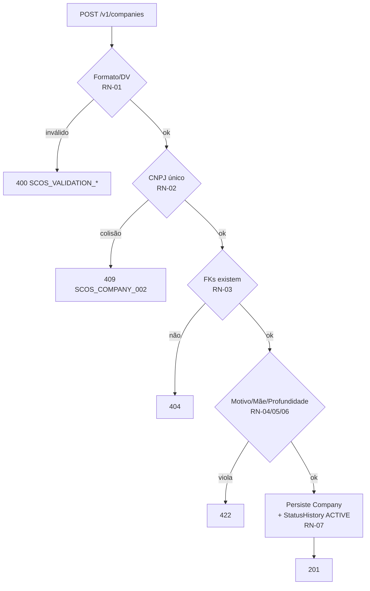
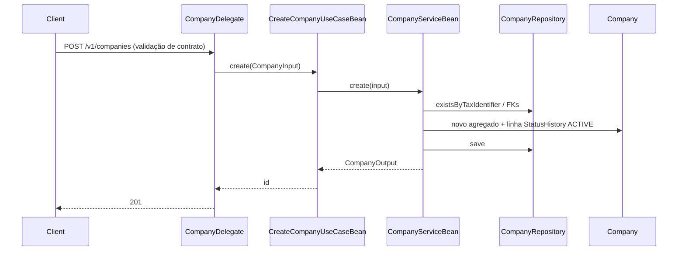

# Cadastro e Atualização de Empresa (Company Core CRUD)

**Data**: 2026-07-07  
**Status**: 🔄 Em Análise  
**Tipo**: 🆕 Nova Feature

---

## ⚠️ Princípio SRP — Uma Funcionalidade por Ideia

> **Regra**: Uma ideia = uma funcionalidade. Features independentes → arquivos separados.

- **Nome da funcionalidade**: `company-core-crud`
- **Resumo em uma frase**: Expõe cadastro (POST), atualização (PUT), consulta por id (GET) e listagem paginada (GET) da Empresa, com as validações de campo nas camadas corretas.

**Checklist SRP**:
- [x] Esta ideia cobre exatamente uma funcionalidade (CRUD cadastral da Empresa)
- [x] Não mistura features independentes no mesmo arquivo
- [x] O nome é específico

**Fora deste arquivo (SRP — cada um vira sua própria ideia):**
- Ciclo de vida de status: enable/disable/block/unblock + status-history (UC-006/007/008/137/138) — transições já existem no agregado `Company`, mas os UseCases/endpoints são outra feature.
- Hierarquia: hierarchy/branches (UC-009/010).
- Sub-recursos: contatos (UC-011..015) e endereços (UC-016..020).
- Natureza Jurídica e CNAE — **já implementados** (commit `42068fb`).

---

## 1️⃣ Visão

### Problema
O agregado `Company` (entidade, `Cnpj` value object, transições de status) e o `CompanyRepository` já existem, mas **não há CRUD cadastral**: faltam `CompanyService`/Bean core, os UseCases de criação/atualização/consulta e o `CompanyDelegate`. Os endpoints UC-001..005 (`/v1/companies`) não respondem.

### Objetivo
Empresa matriz e filial podem ser cadastradas, atualizadas, consultadas por id e listadas com paginação/filtro, retornando os status HTTP e códigos de erro do `01-empresa.md`. Sucesso = os UC-S/UC-E de UC-001..005 verdes em teste de integração.

### Fora de Escopo
- Transições de status e histórico (arquivo próprio).
- Hierarquia (hierarchy/branches).
- Contatos e endereços da empresa.

---

## 2️⃣ Requisitos

### Funcionais
- [ ] **RF-01**: `POST /v1/companies` cria matriz (`parentCompanyId` nulo) ou filial → `201` (UC-001/002).
- [ ] **RF-02**: `PUT /v1/companies/{id}` atualiza dados cadastrais (`parentCompanyId` **não** editável) → `204` (UC-005).
- [ ] **RF-03**: `GET /v1/companies/{id}` → `200` com `Company` completo (inclui `parentCompany`, dados fiscais); `404 SCOS_COMPANY_001` se não existir (UC-003).
- [ ] **RF-04**: `GET /v1/companies` lista paginada com filtro por status e/ou nome → `200` com array do schema-resumo `Companies` + `paginatedDTO` (UC-004).
- [ ] **RF-05**: Criação insere 1ª linha em `SCOS_COMPANY_STATUS_HISTORY` com `newStatus=ACTIVE` e `reasonActivateId` (side effect UC-001).
- [ ] **RF-06**: `PUT` aceita `stateRegistration` (texto livre ou literal `"ISENTO"`) e `municipalRegistration` opcionais, além dos dados fiscais `legalNatureId`/`cnaePrincipalId`.

### Não-Funcionais
- [ ] **RNF-01**: `taxIdentifier` (CNPJ Alfa) validado no formato/DV **antes** de qualquer acesso a banco (`x-is-cnpj`, `pattern ^[A-Z0-9]{12}[0-9]{2}$`).
- [ ] **RNF-02**: Idempotência **apenas no POST** via `@JdempotentRequestPayload` sobre `taxIdentifier` (`x-jdempotentrequestpayload: true` já marcado no contrato; PUT não é idempotente por esse mecanismo).
- [ ] **RNF-03**: Fronteira transacional conforme padrão do projeto (`padronizacao-transactional-camadas`): `@Transactional` de escrita no `CompanyServiceBean` (create/update); leitura `@Transactional(readOnly = true)` em findById/findAll. UseCase não abre transação.
- [ ] **RNF-04**: Autorização por permissão `x-authorize`: `CREATE_COMPANY` (POST), `UPDATE_COMPANY` (PUT), `GET_COMPANY` (GET id e lista).

---

## 3️⃣ Arquitetura

### Componentes Afetados
```
scos-organization-api
└── delegate/company/CompanyDelegate: adição (implements CompanyApiDelegate)

scos-organization-usecase
├── .../company/CreateCompanyUseCase(+Bean): adição
├── .../company/UpdateCompanyUseCase(+Bean): adição
├── .../company/FindCompanyUseCase(+Bean): adição
├── .../company/FindAllCompanyUseCase(+Bean): adição
└── .../company/CompanyApiMapper: adição

scos-organization-domain
├── .../company/specification/CompanyService: adição
├── .../company/service/CompanyServiceBean: adição
├── .../company/service/CompanyMapper: adição
└── .../company/dto/CompanyInput|CompanyOutput: adição
```

### Fluxo Principal (POST)
```
Request → [Delegate/boundary: formato+presença+DV] → [UseCase Bean: só orquestra]
        → [CompanyServiceBean: unicidade+FK+regras cross-entity]
        → [Company aggregate: monta 1ª linha StatusHistory] → 201
```

### ⭐ Decisão central — em que camada vai cada validação

> Regra: **a validação mora onde moram os dados que ela precisa.** UseCase nunca valida — só orquestra.

| A validação precisa de… | Camada | Exemplos (Company) | Erro |
|---|---|---|---|
| Só o valor do campo | **Contrato** (YAML → bean-validation + validator) | presença/vazio/tamanho (`name`≤250, `nameTreatment`≤100); `taxIdentifier` 14 alfanum + DV (`x-is-cnpj`); `foundationDate` não-futura; `sectorOfActivity` texto livre ≤100; `stateRegistration`/`municipalRegistration` texto | `SCOS_VALIDATION_001/003/010` |
| DB / outros agregados | **Domain Service** (`CompanyServiceBean`) | `taxIdentifier` único; `reasonActivateId` existe + `ACTIVE` + `entityType=COMPANY`; `parentCompany` existe + `ACTIVE`; `legalNatureId`/`cnaePrincipalId` existem; profundidade ≤ `COMPANY_HIERARCHY_MAX_DEPTH` | `SCOS_COMPANY_001/002`, `404`, `422` |
| Só o estado do próprio agregado | **Entity** (`Company`) | guardas de transição (já implementadas: `activate/inactivate/disable/enable`) | `SCOS_COMPANY_007` |
| Nada — orquestra | **UseCase Bean** | map API DTO → `CompanyInput`, chama service, map back | — |

### Decisões Técnicas
| Decisão | Escolha | Alternativa Descartada | Motivo |
|---------|---------|------------------------|--------|
| Validação de formato/DV do CNPJ | Contrato (`x-is-cnpj`) + `Cnpj` value object no domínio | Validar no UseCase | Falha barata antes do banco; VO garante invariante no domínio; padrão já existente (`CreateContactTypeUseCaseBean` não valida) |
| Validação de negócio (unicidade/FK/status) | `CompanyServiceBean` | UseCase Bean | Precisa de repositório/outros agregados; espelha `ContactTypeServiceBean.create` (`existsBy...` → `throw ScosException`) |
| Guarda de transição de status | Método no agregado `Company` | Service | Depende só do estado próprio; já implementado |
| Reuso da validação de `reasonActivateId` | Reaproveitar service/repo de `ReasonActivate` já existente | Reimplementar checagem | DRY; `entityType=COMPANY` + `ACTIVE` já centralizados |

### Banco de Dados
- **Impacto**: ❌ Não (tabelas `SCOS_COMPANY` e `SCOS_COMPANY_STATUS_HISTORY` já existem; Company entity + repos prontos).

---

## 4️⃣ Implementação

### Arquivos

**Novos**:
- `scos-organization-api/.../delegate/company/CompanyDelegate.java` — expõe UC-001..005.
- `scos-organization-usecase/.../company/{Create,Update,Find,FindAll}CompanyUseCase(+Bean).java` — orquestração.
- `scos-organization-usecase/.../company/CompanyApiMapper.java` — API DTO ⇄ domain Input/Output.
- `scos-organization-domain/.../company/specification/CompanyService.java` + `service/CompanyServiceBean.java` + `service/CompanyMapper.java` — regras de negócio.
- `scos-organization-domain/.../company/dto/CompanyInput.java` + `CompanyOutput.java`.

**Modificados**:
- `etc/api/organization/ScosOrganization_Company.yml` — confirmar operations/responses de UC-001..005 (schemas já existem).
- `ScosOrganizationPermission` — `CREATE_COMPANY`/`UPDATE_COMPANY`/`GET_COMPANY` se ausentes (enum está desatualizado — 00-indice §3.6).

### Tarefas
- [ ] **T-01**: Contrato — validar YAML dos 4 endpoints (200 com `data:`, 201/204/4XX via ScosComponents).
- [ ] **T-02**: Domínio — `CompanyService` + `CompanyServiceBean` (create/update/findById/findAll) com regras cross-entity.
- [ ] **T-03**: UseCases + `CompanyApiMapper` (sem validação).
- [ ] **T-04**: `CompanyDelegate`.
- [ ] **T-05**: Testes de integração (Testcontainers) cobrindo UC-S/UC-E de UC-001..005.

### Riscos e Edge Cases
1. Ordem das regras importa: formato (400) antes de unicidade (409) antes de compatibilidade de motivo (422) — respeitar a sequência do `01-empresa.md`.
2. `reasonActivateId` na criação: validar `entityType=COMPANY` e `ACTIVE=true` (UC-E5/E6) reusando o service de `ReasonActivate` já existente. Erros retornam **texto**, sem código de negócio dedicado (só `404`/`422`).
3. Filial: profundidade contada da raiz ≤ `COMPANY_HIERARCHY_MAX_DEPTH` (UC-E9).
4. Update não pode alterar `parentCompanyId`; unicidade de `taxIdentifier` exclui o próprio `{id}`.
5. ~~Lista fixa de `sectorOfActivity`~~ **Resolvido**: é `VARCHAR(100)` texto livre (sem enum/tabela); valida só presença + tamanho ≤100. `01-empresa.md` foi corrigido para remover a menção a "lista fixa". Não confundir com `cnaePrincipalId` (CNAE oficial granular) nem `legalNatureId` (forma jurídica) — são FKs próprias e coexistem.

---

## 2.1 Regras de Negócio

> Regras que governam o comportamento do cadastro/atualização da Empresa. Ordem de avaliação = ordem de retorno de erro.

### RN-01 — Obrigatoriedade e formato de campo (camada Contrato)
- **Descrição**: `name`, `nameTreatment`, `taxIdentifier`, `foundationDate`, `sectorOfActivity` obrigatórios; no POST também `reasonActivateId`. `taxIdentifier` = 14 chars `^[A-Z0-9]{12}[0-9]{2}$` com DV válido (CNPJ Alfa); `foundationDate` válida e não-futura; `name`≤250, `nameTreatment`≤100; `sectorOfActivity` texto livre ≤100 (**sem lista fixa** — `VARCHAR(100)` NOT NULL; ≠ CNAE/Natureza Jurídica, que são FKs próprias).
- **Justificativa**: falha barata antes do banco; invariante estrutural.
- **Válido**: `taxIdentifier="12ABC34500012"` com DV correto.
- **Inválido**: ausente → `400 SCOS_VALIDATION_003`; vazio → `400 SCOS_VALIDATION_001`; DV errado → `400 SCOS_VALIDATION_010`.
- **Impacto técnico**: bean-validation gerada do YAML + validator `x-is-cnpj` + `Cnpj` VO no domínio.

### RN-02 — Unicidade de `taxIdentifier`
- **Descrição**: `taxIdentifier` único em `SCOS_COMPANY` considerando **todos os status**. No PUT, exclui o próprio `{id}`.
- **Justificativa**: CNPJ identifica unicamente a empresa.
- **Válido**: CNPJ inédito.
- **Inválido**: colisão → `409 SCOS_COMPANY_002`.
- **Impacto técnico**: `existsByTaxIdentifier(...)` (create) / `...AndIdNot(id)` (update) no `CompanyServiceBean`.

### RN-03 — Integridade referencial das FKs
- **Descrição**: `reasonActivateId` (POST) deve existir; se informados, `parentCompanyId`, `legalNatureId`, `cnaePrincipalId` devem existir.
- **Justificativa**: consistência relacional cross-agregado.
- **Válido**: todos os ids apontam para registros existentes.
- **Inválido**: `reasonActivateId` inexistente → `404` ("motivo não encontrado"); `parentCompanyId` inexistente → `404` ("empresa mãe não encontrada").
- **Impacto técnico**: checagens via repositórios no `CompanyServiceBean`.

### RN-04 — Compatibilidade do motivo de ativação
- **Descrição**: `reasonActivateId` deve ter `ACTIVE=true` e `entityType=COMPANY`.
- **Justificativa**: motivo inativo/incompatível não pode originar histórico de status.
- **Válido**: motivo ativo com `entityType=COMPANY`.
- **Inválido**: `ACTIVE=false` → `422` ("motivo inativo"); `entityType=EMPLOYEE` → `422` ("motivo incompatível com a entidade").
- **Impacto técnico**: reuso do service de `ReasonActivate`.

### RN-05 — Empresa mãe ativa
- **Descrição**: se `parentCompanyId` informado, a empresa mãe deve estar `ACTIVE`.
- **Justificativa**: não vincular filial a matriz inativa/bloqueada.
- **Válido**: mãe `ACTIVE`.
- **Inválido**: mãe `INACTIVE`/`DISABLED` → `422` ("empresa mãe não está ativa").
- **Impacto técnico**: leitura do status da mãe no service.

### RN-06 — Limite de profundidade da hierarquia
- **Descrição**: para filial, a profundidade resultante contada da raiz ≤ `COMPANY_HIERARCHY_MAX_DEPTH` (config `INTEGER`).
- **Justificativa**: limitar aninhamento de filiais.
- **Válido**: profundidade dentro do limite.
- **Inválido**: excede → `422` ("limite de hierarquia atingido").
- **Impacto técnico**: cálculo de profundidade a partir de `parentCompanyId` no service.

### RN-07 — Side effect de criação (histórico de status)
- **Descrição**: criação insere 1ª linha em `SCOS_COMPANY_STATUS_HISTORY` com `newStatus=ACTIVE` e o `reasonActivateId` informado.
- **Justificativa**: trilha imutável de status desde a origem.
- **Válido**: empresa nasce `ACTIVE` com histórico consistente.
- **Inválido**: — (é efeito, não validação).
- **Impacto técnico**: o agregado `Company` monta a linha; persistência na mesma transação de escrita.

### RN-08 — `parentCompanyId` imutável no update
- **Descrição**: `PUT` não altera `parentCompanyId` (campo ausente do `UpdateCompanyRequest`).
- **Justificativa**: mudança de hierarquia é outra feature; ciclo (`SCOS_COMPANY_004`) é estruturalmente impossível hoje.
- **Válido**: PUT sem `parentCompanyId`.
- **Inválido**: — (campo não existe no contrato de update).
- **Impacto técnico**: mapper de update ignora hierarquia.

---

## Casos de Uso

### UC-001/002 — POST /v1/companies (criar matriz/filial) | `CREATE_COMPANY`
**Pré-condições**: token válido com `CREATE_COMPANY`; `reasonActivateId` ativo e `entityType=COMPANY`.  
**Fluxo principal**: valida formato/DV (RN-01) → unicidade CNPJ (RN-02) → FKs (RN-03) → compatibilidade motivo (RN-04) → mãe ativa se filial (RN-05) → profundidade (RN-06) → persiste Company + 1ª linha StatusHistory `ACTIVE` (RN-07) → `201`.  
**Fluxos alternativos**: E1 CNPJ ausente `400`; E2 DV inválido `400 SCOS_VALIDATION_010`; E3 CNPJ duplicado `409 SCOS_COMPANY_002`; E4 motivo inexistente `404`; E5 motivo inativo `422`; E6 motivo `entityType=EMPLOYEE` `422`; E7 mãe inexistente `404`; E8 mãe inativa `422`; E9 profundidade excedida `422`.  
**Pós-condições**: empresa `ACTIVE` persistida; histórico inicial criado.

### UC-005 — PUT /v1/companies/{id} (atualizar) | `UPDATE_COMPANY`
**Pré-condições**: token com `UPDATE_COMPANY`; `{id}` existente.  
**Fluxo principal**: valida formato/DV (RN-01, sem `reasonActivateId`) → unicidade CNPJ excluindo `{id}` (RN-02) → FKs de `legalNatureId`/`cnaePrincipalId` (RN-03) → atualiza dados cadastrais (RN-08: sem hierarquia) → `204`.  
**Fluxos alternativos**: E1 obrigatório ausente/vazio `400 SCOS_VALIDATION_003/001`; E2 CNPJ duplicado `409 SCOS_COMPANY_002`; E3 `{id}` inexistente `404 SCOS_COMPANY_001`.  
**Pós-condições**: dados cadastrais atualizados; `parentCompanyId` inalterado.

### UC-003 — GET /v1/companies/{id} | `GET_COMPANY`
**Pré-condições**: token com `GET_COMPANY`.  
**Fluxo principal**: busca por id → `200` com `Company` completo (`data:`).  
**Fluxos alternativos**: E1 `{id}` inexistente → `404 SCOS_COMPANY_001`.  
**Pós-condições**: nenhuma (leitura).

### UC-004 — GET /v1/companies | `GET_COMPANY`
**Pré-condições**: token com `GET_COMPANY`.  
**Fluxo principal**: aplica paginação padrão e filtros opcionais (status e/ou nome) → `200` com array de `Companies` (resumo) + `paginatedDTO`.  
**Fluxos alternativos**: E1 token ausente/expirado → `401`.  
**Pós-condições**: nenhuma (leitura).

---

## Critérios de Aceitação (BDD)

```gherkin
Cenário: Criar empresa matriz com dados válidos
Dado um token com permissão CREATE_COMPANY
E um reasonActivateId ativo com entityType=COMPANY
Quando envio POST /v1/companies com CNPJ Alfa válido e parentCompanyId nulo
Então recebo 201
E existe uma linha em SCOS_COMPANY_STATUS_HISTORY com newStatus=ACTIVE

Cenário: Rejeitar CNPJ com dígito verificador inválido
Dado um token com permissão CREATE_COMPANY
Quando envio POST /v1/companies com taxIdentifier de DV inválido
Então recebo 400 com código SCOS_VALIDATION_010

Cenário: Rejeitar CNPJ duplicado
Dado uma empresa já cadastrada com determinado taxIdentifier
Quando envio POST /v1/companies com o mesmo taxIdentifier
Então recebo 409 com código SCOS_COMPANY_002

Cenário: Rejeitar filial com empresa mãe inativa
Dado uma empresa mãe com status INACTIVE
Quando envio POST /v1/companies com parentCompanyId apontando para ela
Então recebo 422 indicando que a empresa mãe não está ativa

Cenário: Atualizar empresa não altera hierarquia
Dado uma empresa existente com parentCompanyId definido
Quando envio PUT /v1/companies/{id} com dados cadastrais válidos
Então recebo 204
E o parentCompanyId permanece inalterado

Cenário: Consultar empresa inexistente
Quando envio GET /v1/companies/{id} para um id inexistente
Então recebo 404 com código SCOS_COMPANY_001
```

---

## Contratos

### REST

**POST /v1/companies — Request**
```json
{
  "name": "SawCunha Tecnologia LTDA",
  "nameTreatment": "SawCunha",
  "taxIdentifier": "12ABC34500012",
  "foundationDate": "2020-05-10",
  "sectorOfActivity": "TECHNOLOGY",
  "observation": "Matriz",
  "parentCompanyId": null,
  "reasonActivateId": 1,
  "legalNatureId": 3,
  "cnaePrincipalId": 42,
  "stateRegistration": "ISENTO",
  "municipalRegistration": "1234567"
}
```

**POST — Response `201`**: `$ref ScosComponents.yml#/components/responses/201_CREATED` (sem corpo de dados; ver convenção do projeto).

**GET /v1/companies/{id} — Response `200`**
```json
{
  "data": {
    "id": 100,
    "name": "SawCunha Tecnologia LTDA",
    "nameTreatment": "SawCunha",
    "taxIdentifier": "12ABC34500012",
    "foundationDate": "2020-05-10",
    "sectorOfActivity": "TECHNOLOGY",
    "observation": "Matriz",
    "parentCompany": null,
    "status": "ACTIVE",
    "legalNatureId": 3,
    "cnaePrincipalId": 42,
    "stateRegistration": "ISENTO",
    "municipalRegistration": "1234567"
  }
}
```

**GET /v1/companies — Response `200`** (resumo + paginação)
```json
{
  "data": [
    { "id": 100, "name": "SawCunha Tecnologia LTDA", "nameTreatment": "SawCunha", "sectorOfActivity": "TECHNOLOGY", "status": "ACTIVE" }
  ],
  "paginatedDTO": { "page": 0, "size": 20, "totalElements": 1, "totalPages": 1 }
}
```

**PUT /v1/companies/{id} — Request**: igual ao POST **sem** `parentCompanyId` e **sem** `reasonActivateId`. Response `204` (`$ref 204_NO_CONTENT`).

**Erros**: `4XX`/`5XX` via `$ref ScosComponents.yml` (RFC 9457 ProblemDetail, `ExceptionsHandler`).

---

## Modelo de Dados

Campos do `CreateCompanyRequest` (contrato). PUT = mesmos, exceto `parentCompanyId`/`reasonActivateId`.

| Campo | Tipo | Obrigatório | Regra |
|---|---|---|---|
| `name` | string | Sim | ≤250; não vazio |
| `nameTreatment` | string | Sim | ≤100; não vazio |
| `taxIdentifier` | string | Sim | 14 chars `^[A-Z0-9]{12}[0-9]{2}$`; DV CNPJ Alfa; único |
| `foundationDate` | date | Sim | válida; não-futura |
| `sectorOfActivity` | string | Sim | texto livre; ≤100 (`VARCHAR(100)` NOT NULL); **sem lista fixa**; distinto de `cnaePrincipalId`/`legalNatureId` |
| `reasonActivateId` | int64 | Sim (POST) | FK `SCOS_REASON_ACTIVATE`; `ACTIVE`; `entityType=COMPANY` |
| `observation` | string | Não | — |
| `parentCompanyId` | int64 | Não (POST) | FK `SCOS_COMPANY`; mãe `ACTIVE`; profundidade ≤ max; imutável no PUT |
| `legalNatureId` | int64 (nullable) | Não | FK `SCOS_LEGAL_NATURE` |
| `cnaePrincipalId` | int64 (nullable) | Não | FK `SCOS_CNAE` |
| `stateRegistration` | string (nullable) | Não | texto livre ou `"ISENTO"` |
| `municipalRegistration` | string (nullable) | Não | — |

Tabelas: `SCOS_COMPANY` (já existe), `SCOS_COMPANY_STATUS_HISTORY` (já existe — recebe linha inicial na criação).

---

## Diagramas

### Fluxo (cascata de validação do POST)


### Sequência


---

## Exemplo de Implementação

```java
// scos-organization-domain — regra de negócio no Service (espelha ContactTypeServiceBean)
@Service
@Transactional
class CompanyServiceBean implements CompanyService {

    @Override
    public CompanyOutput create(CompanyInput input) {
        if (companyRepository.existsByTaxIdentifier(input.taxIdentifier())) {
            throw new ScosException(ExceptionCodeError.SCOS_COMPANY_002); // 409
        }
        var reason = reasonActivateService.getActiveForCompany(input.reasonActivateId()); // 404/422
        Company parent = resolveActiveParent(input.parentCompanyId());                    // 404/422 + profundidade
        Company company = Company.create(input, parent, reason); // agregado monta 1ª linha StatusHistory ACTIVE
        return companyMapper.toOutput(companyRepository.save(company));
    }
}
```

```java
// scos-organization-usecase — só orquestra, NÃO valida
@Service
class CreateCompanyUseCaseBean implements CreateCompanyUseCase {
    @Override
    public Long create(CompanyInput input) {
        return companyService.create(input).id();
    }
}
```

---

## Estratégia de Testes

- **Unitário** (JUnit 5 + Mockito + AssertJ): `CompanyServiceBean` com repositórios mockados — cobre RN-02..RN-06 (unicidade, FK inexistente, motivo inativo/incompatível, mãe inativa, profundidade). `CompanyMapper`/`CompanyApiMapper` (mapeamento e imutabilidade de `parentCompanyId` no update). Guardas do agregado `Company`.
- **Integração** (Testcontainers + Postgres real): UC-001..005 fim-a-fim, cobrindo cada UC-S e UC-E de `01-empresa.md`; verifica o side effect RN-07 (linha em `SCOS_COMPANY_STATUS_HISTORY`); ordem de retorno de erro (400 → 409 → 404 → 422).
- **E2E**: fora do escopo desta feature (coberto pela suíte k6 de ambiente de integração, ideia própria).

---

## ❓ Questões Abertas

- ~~**Q-01 — Fonte da verdade de `sectorOfActivity`**~~ — **Resolvido (2026-07-14)**. Implementação real = `VARCHAR(100)` texto livre, sem `enum`/tabela (`Company.java`, `scos_company.yml`, seed `'Tecnologia da Informação'`). Decisão: **manter texto livre** e alinhar `01-empresa.md` (menção a "lista fixa" removida). `sectorOfActivity` (setor amplo, texto) é distinto de `cnaePrincipalId` (FK CNAE oficial) e `legalNatureId` (FK natureza jurídica) — os três coexistem. Nenhuma questão aberta pendente.

---

## 📎 Referências
- `etc/doc/usecase/01-empresa.md` (UC-001..005)
- `etc/doc/usecase/00-indice-central.md` (catálogo de erros, `COMPANY_HIERARCHY_MAX_DEPTH`, status Company, §3.6 enum de permissões)
- `etc/api/organization/ScosOrganization_Company.yml` (schemas `CreateCompanyRequest`, `UpdateCompanyRequest`, `Company`, `Companies`)
- Padrão de referência: `CreateContactTypeUseCaseBean` / `ContactTypeServiceBean` / `ContactType`
- Change relacionado: `padronizacao-transactional-camadas` (fronteira `@Transactional`)
