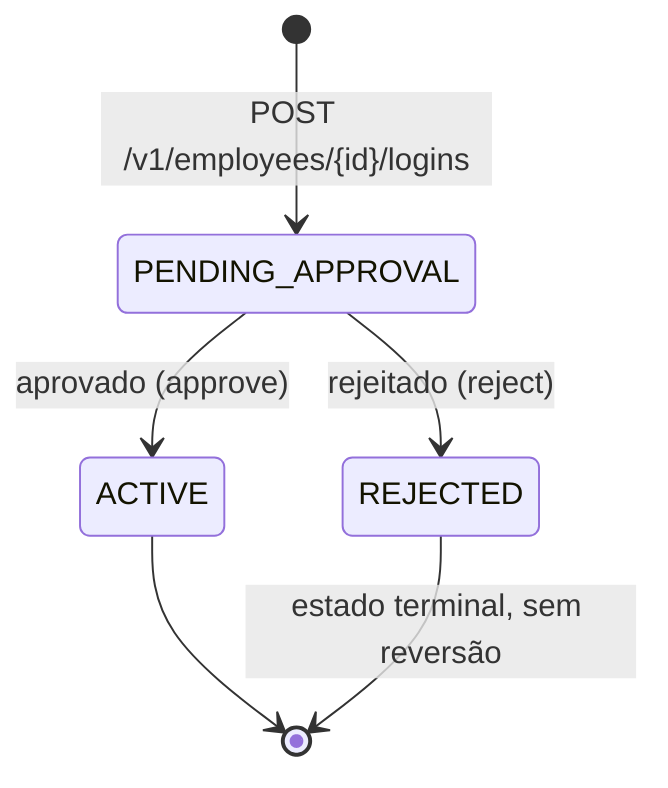
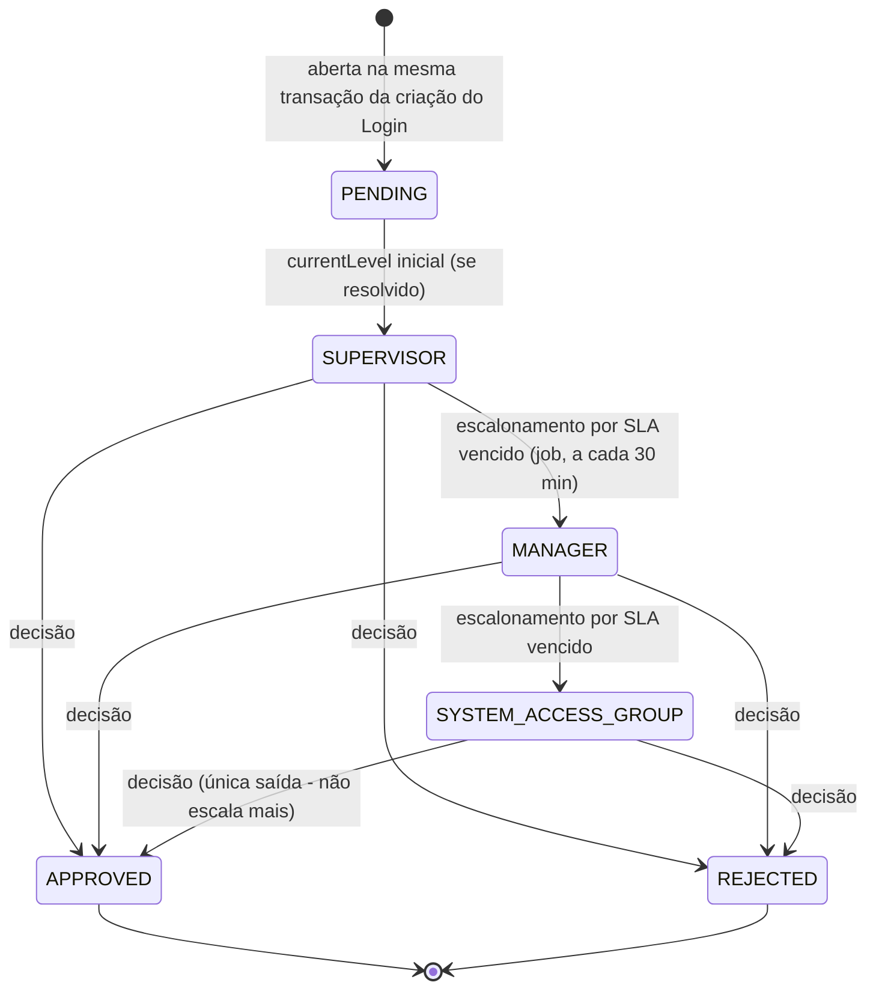
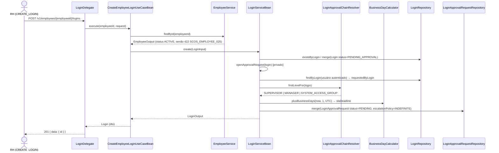
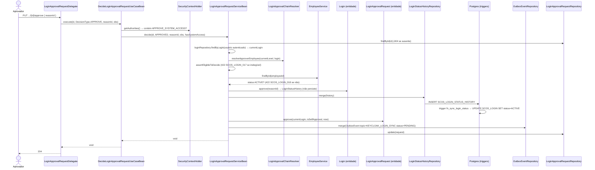
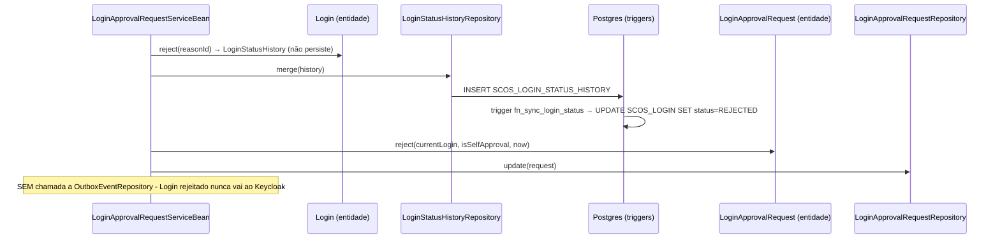
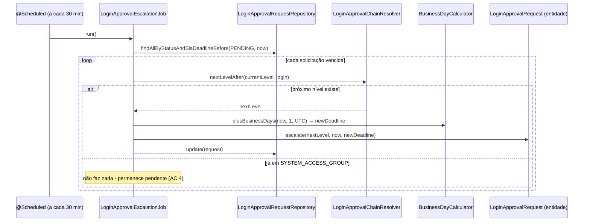
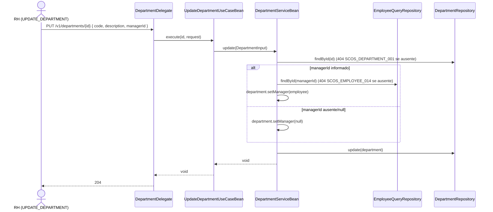
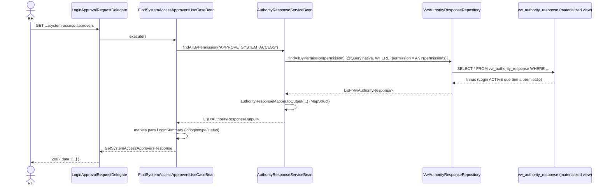

# Fluxo da Cadeia de Aprovação de Acesso — Login (Story 3.2)

> Parte do conjunto de documentos de regras por endpoint do scos-organization. Consultar **00-indice-central.md** para o catálogo central (status, erros, configuração) e **04-login-perfil-recurso-sistema.md** para o catálogo endpoint-a-endpoint de Login/Profile/Resource/System.
>
> **Este documento é diferente dos demais (00-07):** em vez de catalogar campo a campo, ele narra os **fluxos ponta a ponta** da cadeia de aprovação — da ação do usuário até a linha gravada no banco — em duas visões complementares: **visão do usuário** (o que a pessoa faz e o que ela vê no fim) e **visão do código** (a sequência real de classes/métodos que o request atravessa, extraída do código-fonte de `flow-organization-domain`/`-usecase`/`-api`, não inferida).
>
> ⚠️ **Nota de consistência:** o Documento 04 (Seção "Modelo de Status", herdado do índice central) descreve o Login como **fire-and-forget** ("nasce `ACTIVE` imediatamente... Login não tem mais `PENDING`") — isso está **desatualizado**. Desde a Story 3.1/3.2, `POST /v1/employees/{employeeId}/logins` cria o Login em **`PENDING_APPROVAL`**, e só a decisão de uma `LoginApprovalRequest` (este documento) o leva a `ACTIVE`/`REJECTED`. Este documento é a fonte de verdade para esse fluxo.

---

## 1. Visão geral





**Camadas atravessadas em todo fluxo** (de fora para dentro):

```
HTTP → *ApiDelegate (gerado) → *Delegate (api) → *UseCase(Bean) (usecase) → *Service (domain, specification+Bean) → *Repository (domain, internal) → Postgres
```

A regra de arquitetura deste projeto é que **a camada `usecase` nunca chama `*Repository` diretamente** — ela só enxerga `*Service` (interface de `domain/.../specification/`). Toda regra que cruza entidades (elegibilidade, transições de status, gravação de Outbox) vive no domain service, não no Use Case.

---

## 2. Fluxo 1 — Criação de Login abre a solicitação automaticamente

### 2.1. Visão do usuário

1. RH (ou quem tem `CREATE_LOGIN`) chama `POST /v1/employees/{employeeId}/logins` informando `login` e `profileId` de um Funcionário `ACTIVE`.
2. **Início:** requisição HTTP autenticada.
3. **Fim:** resposta `201`, Login criado em `PENDING_APPROVAL`. Nenhuma ação adicional é necessária — a solicitação de aprovação já existe, pronta para ser consultada por quem for elegível a decidir (Fluxo 3/4).
4. O usuário **não vê** a `LoginApprovalRequest` diretamente nesta resposta — só o `id` do Login. Para ver a solicitação, é preciso `GET /v1/login-approval-requests?loginId={id}` (Fluxo 2).

### 2.2. Visão do código



**Classes envolvidas:** `LoginDelegate` (api) → `CreateEmployeeLoginUseCase`/`Bean` (usecase) → `EmployeeService`, `LoginService`/`LoginServiceBean` (domain) → `LoginApprovalChainResolver`, `BusinessDayCalculator` (domain, função pura/utilitário) → `LoginRepository`, `LoginApprovalRequestRepository` (domain, internal).

**Decisão de nível inicial** (`LoginApprovalChainResolver.firstLevelFor`): `SUPERVISOR` se o Funcionário tem supervisor cadastrado; senão `MANAGER` se o Departamento do Cargo tem `manager` cadastrado (ver Fluxo 6); senão `SYSTEM_ACCESS_GROUP`. Para Login `EXTERNAL`/`SERVICE` (sem Funcionário — Epic 4), sempre `SYSTEM_ACCESS_GROUP` direto.

---

## 3. Fluxo 2 — Consulta de solicitações

### 3.1. Visão do usuário

1. Um aprovador (supervisor, gerente, ou titular de `APPROVE_SYSTEM_ACCESS`) quer saber o que precisa decidir hoje — não existe notificação proativa (Motor de Notificação é Etapa 3/P2).
2. **Início:** `GET /v1/login-approval-requests` (lista, filtrável por `status`/`loginId`) ou `GET /v1/login-approval-requests/{id}` (detalhe).
3. **Fim:** resposta `200` com a lista/detalhe, incluindo `currentApprover` (nome/id do Funcionário resolvido para o nível atual — `null` quando o nível é `SYSTEM_ACCESS_GROUP`, que não resolve uma pessoa específica). O usuário usa esse campo para saber se **é ele** quem deve agir.

### 3.2. Visão do código

```mermaid
sequenceDiagram
    actor User as Aprovador
    participant Delegate as LoginApprovalRequestDelegate
    participant UC as FindLoginApprovalRequestUseCaseBean
    participant Svc as LoginApprovalRequestServiceBean
    participant Resolver as LoginApprovalChainResolver
    participant Repo as LoginApprovalRequestRepository
    participant Mapper as LoginApprovalRequestApiMapper

    User->>Delegate: GET /v1/login-approval-requests/{id}
    Delegate->>UC: execute(id)
    UC->>Svc: findById(id)
    Svc->>Repo: findById(id)  (404 SCOS_LOGIN_APPROVAL_REQUEST_001 se ausente)
    Svc->>Resolver: resolveApproverEmployee(currentLevel, login)
    Resolver-->>Svc: Optional&lt;Employee&gt; (calculado na hora, nunca persistido - AC 10)
    Svc-->>UC: LoginApprovalRequestOutput (com currentApproverEmployeeId/Name)
    UC->>Mapper: toApiLoginApprovalRequest(output)
    Mapper-->>UC: LoginApprovalRequest (dto da API)
    UC-->>Delegate: GetLoginApprovalRequestResponse
    Delegate-->>User: 200 { data: {..., currentApprover} }
```

`GET /v1/login-approval-requests` (lista) segue o mesmo caminho via `FindAllLoginApprovalRequestUseCaseBean` → `LoginApprovalRequestServiceBean.findAll(status, loginId, pageable)`, resolvendo `currentApprover` **por item da página** (não da tabela inteira).

---

## 4. Fluxo 3 — Aprovação (`PUT .../approve`)

### 4.1. Visão do usuário

1. O aprovador elegível (o Funcionário resolvido no nível atual, **ou** qualquer titular de `APPROVE_SYSTEM_ACCESS` como válvula de última instância) chama `PUT /v1/login-approval-requests/{id}/approve` com `{ reasonId }` (motivo do catálogo `ReasonActivate`).
2. **Início:** requisição HTTP autenticada, com a permissão `DECIDE_LOGIN_APPROVAL_REQUEST`.
3. **Fim:** resposta `204`. O Login vinculado passa a `ACTIVE` (confirmável via `GET /v1/logins/{loginId}`), a solicitação passa a `APPROVED` (confirmável via `GET /v1/login-approval-requests/{id}`), e a Saga Keycloak é disparada em background (grava um evento no Outbox — ainda sem dispatcher real, guarda de escopo da Story 3.1/3.2).
4. Se o aprovador **não for elegível** (não é o resolvido nem detém `APPROVE_SYSTEM_ACCESS`): `422 SCOS_LOGIN_017`. Se o Funcionário do Login foi desligado entre a criação e a decisão: `422 SCOS_LOGIN_018`.

### 4.2. Visão do código



**Elegibilidade (`assertEligibleToDecide`, em `LoginApprovalRequestServiceBean`):**

| Cenário | Resultado |
| --- | --- |
| É o Funcionário resolvido no nível atual | Aprova/rejeita normalmente |
| Não é o resolvido, mas detém `APPROVE_SYSTEM_ACCESS` | Aprova/rejeita normalmente (válvula) |
| Não é o resolvido e não detém a permissão | `422 SCOS_LOGIN_017` |
| É o próprio Login sendo decidido (auto-aprovação) e detém `APPROVE_SYSTEM_ACCESS` | Aprova/rejeita, grava `isExceptionSelfApproval=true` |
| É o próprio Login sendo decidido e **não** detém a permissão | `422 SCOS_LOGIN_017` |

---

## 5. Fluxo 4 — Rejeição (`PUT .../reject`)

### 5.1. Visão do usuário

1. Mesmo aprovador elegível do Fluxo 3, chama `PUT /v1/login-approval-requests/{id}/reject` com `{ reasonId, observation }` (motivo do catálogo `ReasonInactivate` — reaproveitado, não existe catálogo `ReasonReject` dedicado).
2. **Início:** requisição HTTP autenticada.
3. **Fim:** resposta `204`. O Login passa a `REJECTED` — **estado terminal, sem reversão** (não existe endpoint para "reabrir" um Login rejeitado; seria necessário criar um novo Login). A solicitação passa a `REJECTED`. **Sem** disparo de Saga Keycloak (o Login nunca chega a existir no Keycloak).

### 5.2. Visão do código

Mesmo caminho do Fluxo 3 até `LoginApprovalRequestServiceBean.decide(...)`, com `decision=REJECTED`:



---

## 6. Fluxo 5 — Escalonamento automático por SLA (job em background)

### 6.1. Visão do usuário

Não há ação de usuário neste fluxo — é 100% automático. Se uma solicitação fica **1 dia útil** sem decisão no nível atual, o sistema a escala sozinha para o próximo nível da cadeia, para que outra pessoa (o próximo nível) possa agir. Se já estiver em `SYSTEM_ACCESS_GROUP` (último nível), ela permanece pendente ali indefinidamente — a política `INDEFINITE` não cancela sozinha.

### 6.2. Visão do código



`LoginApprovalEscalationJob` é o **primeiro `@Scheduled` do projeto** — `@EnableScheduling` foi adicionado em `ScosOrganizationApplication` para habilitá-lo.

---

## 7. Fluxo 6 — Definir o Gerente do Departamento (pré-requisito para o nível MANAGER resolver)

### 7.1. Visão do usuário

1. RH (ou quem tem `UPDATE_DEPARTMENT`) chama `PUT /v1/departments/{id}` informando `managerId` no corpo (reaproveita o endpoint de atualização existente, junto com `code`/`description` — não é uma rota nova).
2. **Início:** requisição HTTP autenticada.
3. **Fim:** resposta `204`. O Departamento passa a ter um Gerente associado — a partir daí, o Fluxo 1 (criação de Login) passa a poder resolver o nível `MANAGER` para Funcionários desse Departamento sem supervisor cadastrado. `managerId` omitido ou `null` **remove** o gerente atual.

### 7.2. Visão do código



---

## 8. Fluxo 7 — Quem pode decidir no nível SYSTEM_ACCESS_GROUP

### 8.1. Visão do usuário

1. RH quer saber quem hoje tem a permissão `APPROVE_SYSTEM_ACCESS` — útil quando `currentApprover` de uma solicitação é `null` (nível `SYSTEM_ACCESS_GROUP` não resolve uma pessoa específica, ver Fluxo 2).
2. **Início:** `GET /v1/login-approval-requests/system-access-approvers` (sem paginação — lista tipicamente pequena).
3. **Fim:** resposta `200` com a lista de Logins `ACTIVE` que detêm a permissão hoje.

### 8.2. Visão do código



⚠️ **Mesma defasagem do Documento 00 (Seção 3.3):** `vw_authority_response` é uma *materialized view*, atualizada via `pg_cron` a cada 30 minutos — uma permissão concedida agora pode levar até 30 minutos para aparecer nesta lista.

---

## 9. Referência rápida — classes por camada

| Camada | Classe | Papel |
| --- | --- | --- |
| api | `LoginApprovalRequestDelegate` | Implementa `LoginApprovalRequestApiDelegate` (gerado). Fino — só chama Use Case |
| usecase | `DecideLoginApprovalRequestUseCase(Bean)` | Traduz `DecisionType` → `LoginApprovalRequestStatus`; resolve `APPROVE_SYSTEM_ACCESS` via `SecurityContextHolder` |
| usecase | `FindLoginApprovalRequestUseCase(Bean)` / `FindAllLoginApprovalRequestUseCase(Bean)` | Paginação (`PaginatioUtils`) + mapeamento via `LoginApprovalRequestApiMapper` |
| usecase | `FindSystemAccessApproversUseCase(Bean)` | Mapeia `AuthorityResponseOutput` → `LoginSummary` |
| usecase | `LoginApprovalRequestApiMapper` | Conversão `LoginApprovalRequestOutput` (domain) ⇄ `LoginApprovalRequest` (api dto). Nunca toca entidade |
| domain (specification) | `LoginApprovalRequestService` | Contrato: `findById`, `findAll`, `decide` |
| domain (specification) | `AuthorityResponseService` | Contrato: `validate`, `findAllByPermission` |
| domain (service) | `LoginApprovalRequestServiceBean` | Toda a regra de negócio: elegibilidade, transições, Outbox |
| domain (service) | `LoginApprovalChainResolver` | Função pura (sem `@Service`): resolve nível/aprovador da cadeia |
| domain (service) | `BusinessDayCalculator` | Soma dias úteis (pula fim de semana) |
| domain (service) | `LoginApprovalEscalationJob` | `@Scheduled` — varre SLA vencido, escala |
| domain (internal) | `Login` | `approve(reasonId)` / `reject(reasonId)` — transição a partir de `PENDING_APPROVAL` |
| domain (internal) | `LoginApprovalRequest` | `escalate()` / `approve()` / `reject()` — guardados por `status==PENDING` |
| domain (internal) | `LoginApprovalRequestRepository`, `LoginRepository`, `LoginStatusHistoryRepository`, `OutboxEventRepository`, `OutboxTopicRepository`, `VwAuthorityResponseRepository` | Acesso a dados — só chamados pelos domain services acima, nunca pela camada usecase |

---

## 10. Referência rápida — códigos de erro deste fluxo

| Código | HTTP | Onde dispara |
| --- | --- | --- |
| `SCOS_LOGIN_016` | 404 | Login do usuário autenticado não encontrado (criação ou decisão) |
| `SCOS_LOGIN_017` | 422 | Quem decide não é elegível (Fluxo 3/4) |
| `SCOS_LOGIN_018` | 422 | Funcionário do Login não está mais `ACTIVE` no momento da decisão |
| `SCOS_LOGIN_APPROVAL_REQUEST_001` | 404 | Solicitação não encontrada |
| `SCOS_LOGIN_APPROVAL_REQUEST_002` | 422 | Solicitação já foi decidida (`status != PENDING`) — guarda interna de `LoginApprovalRequest.escalate/approve/reject` |
| `SCOS_LOGIN_APPROVAL_REQUEST_003` | 500 | Tópico `KEYCLOAK_LOGIN_SYNC` não semeado — precondição de infraestrutura, não deveria acontecer em produção |
| `SCOS_EMPLOYEE_014` | 404 | `managerId` (Fluxo 6) não corresponde a nenhum Funcionário |

Catálogo completo de validação de campo (`SCOS_VALIDATION_*`) e demais módulos: ver **00-indice-central.md**, Seção 2.
